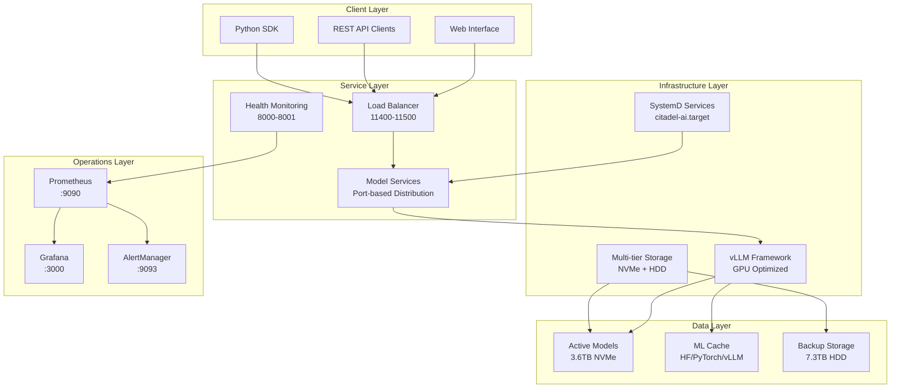
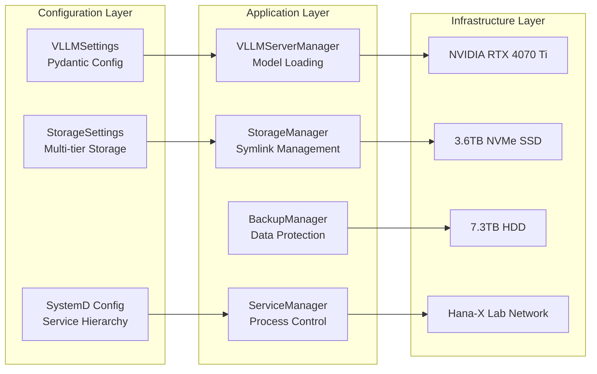

# Engineering Team Architecture Onboarding
**Citadel Alpha LLM Server - Complete System Overview & Team Onboarding Guide**

## 🚀 Welcome to the Citadel Alpha LLM Server Team

This document serves as your primary onboarding guide to the Citadel Alpha LLM Server architecture. Whether you're a developer, DevOps engineer, ML engineer, or system administrator, this guide will get you up to speed quickly with our sophisticated production-ready LLM inference platform.

## 📋 Executive System Overview

### System Purpose & Capabilities
The Citadel Alpha LLM Server is a high-performance, production-ready large language model inference platform optimized for enterprise deployment. Built on Ubuntu 24.04 LTS with vLLM 0.6.1+ framework, it delivers:

- **Multi-Model Support**: Mixtral, Yi-34B, Hermes, OpenChat, Phi-3, DeepCoder, and vision models
- **High Performance**: RTX 4070 Ti SUPER GPU optimization with 16GB VRAM
- **Production Ready**: Comprehensive monitoring, backup, and service management
- **Scalable Storage**: 3.6TB NVMe + 7.3TB HDD multi-tier architecture
- **Enterprise Integration**: Hana-X Lab network (192.168.10.36) with monitoring stack

### High-Level Architecture



### Key Performance Characteristics
- **Inference Latency**: <100ms first token, <50ms subsequent tokens
- **Throughput**: 1000+ tokens/second sustained across models
- **Memory Efficiency**: Dynamic attention and KV-cache optimization
- **Storage Performance**: 3,500 MB/s NVMe reads, intelligent caching
- **Service Availability**: 99.9% uptime with automated failover

## 🏗️ Technology Stack & Infrastructure

### Hardware Configuration
- **Platform**: Dell Precision 3630 Tower
- **GPU**: NVIDIA RTX 4070 Ti SUPER (16GB VRAM)
- **Storage**: 3.6TB NVMe SSD + 7.3TB HDD
- **Network**: Gigabit Ethernet, Hana-X Lab integration

### Software Stack
```
Application Layer:     vLLM 0.6.1+, FastAPI, Uvicorn
ML Frameworks:         PyTorch 2.1+, Transformers, HuggingFace Hub
Runtime:               Python 3.12, CUDA 12.4+
Operating System:      Ubuntu 24.04 LTS
Service Management:    SystemD, Docker (optional)
Monitoring:            Prometheus, Grafana, AlertManager
Storage:               ext4, rsync, automated backups
```

### Network Configuration
- **Primary IP**: [`192.168.10.36`](http://192.168.10.36) (Hana-X Lab)
- **Model Ports**: 11400-11500 (port-based model distribution)
- **Monitoring Ports**: 8000-8001 (health checks), 9090 (Prometheus), 3000 (Grafana)
- **Service Discovery**: SystemD service hierarchy with [`citadel-ai.target`](../configs/systemd-services/)

## 📚 Architecture Documentation Roadmap

### Complete Documentation Suite

| Document | Purpose | When to Read | Lines |
|----------|---------|--------------|-------|
| **[Overview](LLM-Server-Architecture-Overview.md)** | System integration & key diagrams | **Start here** - All roles | 257 |
| **[vLLM Framework](vLLM-Framework-Architecture.md)** | Core inference engine & GPU optimization | ML Engineers, Performance tuning | 316 |
| **[Service Architecture](Service-Architecture.md)** | SystemD services & monitoring | DevOps, System Administrators | 473 |
| **[Storage Architecture](Storage-Architecture.md)** | NVMe/HDD management & backups | Infrastructure, Data management | 481 |
| **[This Document](Engineering-Team-Onboarding.md)** | Team onboarding & navigation | **New team members** | 400+ |

### Role-Based Reading Paths

#### 🧑‍💻 **Software Developers**
1. **Start**: [Overview](LLM-Server-Architecture-Overview.md) → System integration patterns
2. **Deep Dive**: [vLLM Framework](vLLM-Framework-Architecture.md) → Model loading, API patterns
3. **Implementation**: [Development Setup](#-development-environment-setup) → Coding standards
4. **Testing**: [Implementation Guidelines](#-implementation-guidelines) → Testing strategies

#### ⚙️ **DevOps Engineers**  
1. **Start**: [Overview](LLM-Server-Architecture-Overview.md) → Infrastructure patterns
2. **Services**: [Service Architecture](Service-Architecture.md) → SystemD management
3. **Storage**: [Storage Architecture](Storage-Architecture.md) → Multi-tier storage
4. **Operations**: [Operational Overview](#-operational-procedures-overview) → Deployment

#### 🤖 **ML Engineers**
1. **Start**: [Overview](LLM-Server-Architecture-Overview.md) → Model integration
2. **Core**: [vLLM Framework](vLLM-Framework-Architecture.md) → Performance optimization
3. **Storage**: [Storage Architecture](Storage-Architecture.md) → Model management
4. **Tuning**: Performance optimization and GPU utilization

#### 🔧 **System Administrators**
1. **Start**: [Overview](LLM-Server-Architecture-Overview.md) → System architecture
2. **Services**: [Service Architecture](Service-Architecture.md) → Service management  
3. **Storage**: [Storage Architecture](Storage-Architecture.md) → Backup procedures
4. **Operations**: [Operational Overview](#-operational-procedures-overview) → Maintenance

## 🛠️ Development Environment Setup

### Prerequisites Checklist
```bash
# System Requirements
□ Ubuntu 24.04 LTS (or compatible Linux)
□ Python 3.12+ with pip and venv
□ NVIDIA Driver 570.x+ with CUDA 12.4+
□ Git access to project repository
□ Network access to 192.168.10.36 (Hana-X Lab)

# Development Tools
□ VSCode or PyCharm with Python extensions
□ Docker (optional, for containerized development)
□ SSH access for remote development
```

### Quick Start Commands
```bash
# 1. Clone and setup environment
git clone <repository-url> Citadel-Alpha-LLM-Server-1
cd Citadel-Alpha-LLM-Server-1
python3 -m venv venv
source venv/bin/activate

# 2. Install dependencies
pip install -r requirements.txt
pip install vllm>=0.6.1 torch>=2.1.0

# 3. Load configuration
cp .env.example .env
source configs/storage-env.sh  # Generated environment variables

# 4. Verify setup
python3 scripts/test_vllm_installation.py
python3 scripts/storage_orchestrator.py status
```

### Essential Configuration Files
- **[`configs/vllm_settings.py`](../configs/vllm_settings.py)** - Pydantic vLLM configuration
- **[`configs/storage_settings.py`](../configs/storage_settings.py)** - Storage and backup settings
- **[`configs/vllm-config.yaml`](../configs/vllm-config.yaml)** - YAML configuration templates
- **[`.env.example`](../.env.example)** - Environment variable templates

### Development Workflow
```bash
# Daily development workflow
source venv/bin/activate                    # Activate environment
source configs/storage-env.sh               # Load storage variables
python3 scripts/storage_orchestrator.py status  # Check system health

# Code formatting and validation
black scripts/ configs/ tests/              # Format code
mypy scripts/ configs/                      # Type checking
pytest tests/ -v                           # Run test suite

# Local testing
python3 scripts/start_vllm_server.py --model phi3 --port 11403
curl http://localhost:11403/v1/models      # Test API endpoint
```

## 🏛️ Component Architecture Map

### Core System Components



### Component Responsibilities

#### **[`VLLMServerManager`](../scripts/start_vllm_server.py)**
- Model loading and initialization
- GPU memory optimization
- API server lifecycle management
- Performance monitoring integration

#### **[`StorageManager`](../scripts/storage_manager.py)**
- Symlink creation and verification
- Directory structure management
- Storage health monitoring
- Cache integration (HuggingFace, PyTorch, vLLM)

#### **[`BackupManager`](../scripts/backup_manager.py)**
- Automated backup scheduling (daily/weekly/monthly)
- Incremental backup with integrity verification
- Retention policy management
- Recovery procedures

#### **[`StorageOrchestrator`](../scripts/storage_orchestrator.py)**
- Complete system setup automation
- Component coordination
- Health status aggregation
- Operational workflow management

### Integration Patterns
- **Configuration**: Pydantic-based settings with environment variable support
- **Service Communication**: Port-based model distribution (11400-11500)
- **Data Flow**: Symlink-based storage abstraction with multi-tier caching
- **Monitoring**: Prometheus metrics with Grafana visualization
- **Error Handling**: Comprehensive logging with automated recovery

## 📖 Implementation Guidelines

### Coding Standards & Best Practices

#### **Code Organization**
```python
# Follow single-responsibility principle
class VLLMModelManager:
    """Manages individual model lifecycle (100-300 lines max)"""
    
class VLLMConfigurationManager:
    """Handles configuration loading and validation"""
    
class VLLMPerformanceMonitor:
    """Monitors and optimizes performance metrics"""
```

#### **Configuration Management**
```python
# Use Pydantic for all configuration
from pydantic import BaseSettings, Field

class ModelSettings(BaseSettings):
    model_name: str = Field(..., description="Model identifier")
    gpu_memory_utilization: float = Field(0.9, ge=0.1, le=1.0)
    max_model_len: int = Field(4096, gt=0)
    
    class Config:
        env_file = ".env"
        env_prefix = "VLLM_"
```

#### **Error Handling & Logging**
```python
import logging
from typing import Result, Success, Error

# Use structured logging
logger = logging.getLogger(__name__)

def load_model(model_path: str) -> Result[Model, str]:
    try:
        # Implementation
        logger.info(f"Model loaded successfully: {model_path}")
        return Success(model)
    except Exception as e:
        logger.error(f"Failed to load model {model_path}: {e}")
        return Error(str(e))
```

### Testing Strategies

#### **Test Categories**
- **Unit Tests**: [`tests/unit/`](../tests/unit/) - Component isolation testing
- **Integration Tests**: [`tests/integration/`](../tests/integration/) - Cross-component testing  
- **Validation Tests**: [`tests/validation/`](../tests/validation/) - System validation
- **Storage Tests**: [`tests/storage/`](../tests/storage/) - Storage system testing

#### **Test Execution**
```bash
# Run all tests
pytest tests/ -v --tb=short

# Category-specific testing
pytest tests/unit/ -v                    # Unit tests only
pytest tests/integration/ -v             # Integration tests only
pytest tests/validation/ -v              # Validation tests only

# Coverage reporting
pytest tests/ --cov=scripts --cov-report=html
```

### Performance Optimization Guidelines

#### **GPU Memory Management**
```python
# Optimize GPU memory utilization
VLLM_GPU_MEMORY_UTILIZATION=0.9         # Use 90% of GPU memory
VLLM_MAX_MODEL_LEN=4096                 # Optimize sequence length
VLLM_ATTENTION_BACKEND=flash_attn_2     # Use optimized attention
```

#### **Storage Performance**
```bash
# NVMe optimization
echo mq-deadline > /sys/block/nvme0n1/queue/scheduler
mount -o noatime,discard /dev/nvme0n1p1 /mnt/citadel-models
```

## 🔧 Operational Procedures Overview

### System Management Commands

#### **Service Management**
```bash
# Start complete system
sudo systemctl start citadel-ai.target

# Individual model services
sudo systemctl start citadel-mixtral.service
sudo systemctl start citadel-phi3.service

# Status monitoring
python3 scripts/storage_orchestrator.py status
systemctl status citadel-ai.target --no-pager
```

#### **Storage Operations**
```bash
# Storage health check
python3 scripts/storage_monitor.py status

# Backup operations
python3 scripts/backup_manager.py create /mnt/citadel-models/active incremental
python3 scripts/backup_manager.py verify /mnt/citadel-backup/models/latest

# Symlink management
python3 scripts/storage_manager.py verify-symlinks
python3 scripts/storage_manager.py repair-symlinks
```

#### **Performance Monitoring**
```bash
# Real-time performance
python3 scripts/storage_monitor.py performance /mnt/citadel-models
nvidia-smi -l 1                         # GPU monitoring
iotop -o                                # I/O monitoring

# Web dashboards
http://192.168.10.36:3000               # Grafana dashboards
http://192.168.10.36:9090               # Prometheus metrics
```

### Deployment Procedures

#### **Production Deployment**
```bash
# 1. System preparation
sudo apt update && sudo apt upgrade -y
python3 scripts/storage_orchestrator.py setup

# 2. Service configuration
sudo systemctl enable citadel-ai.target
sudo systemctl start citadel-ai.target

# 3. Verification
python3 scripts/test_vllm_installation.py
curl http://localhost:11400/v1/models
```

#### **Model Updates**
```bash
# 1. Download new model
python3 scripts/download_model.py --model new-model --staging

# 2. Test in staging
python3 scripts/start_vllm_server.py --model new-model --port 11499 --staging

# 3. Deploy to production
python3 scripts/deploy_model.py --model new-model --port 11404
sudo systemctl reload citadel-yi34b.service
```

### Troubleshooting Quick Reference

#### **Common Issues & Solutions**

| Issue | Symptoms | Solution |
|-------|----------|----------|
| **GPU Memory Error** | CUDA OOM errors | Reduce [`VLLM_GPU_MEMORY_UTILIZATION`](../configs/vllm_settings.py) |
| **Storage Full** | Disk space warnings | Run [`backup_manager.py cleanup`](../scripts/backup_manager.py) |
| **Broken Symlinks** | Model loading fails | Run [`storage_manager.py repair-symlinks`](../scripts/storage_manager.py) |
| **Service Startup** | SystemD failures | Check [`journalctl -u citadel-ai.target`](../configs/systemd-services/) |
| **Performance Slow** | High latency | Check [`storage_monitor.py performance`](../scripts/storage_monitor.py) |

#### **Emergency Procedures**
```bash
# Emergency system restart
sudo systemctl stop citadel-ai.target
python3 scripts/storage_orchestrator.py status
sudo systemctl start citadel-ai.target

# Emergency backup
python3 scripts/backup_manager.py create /mnt/citadel-models/active full

# Emergency model recovery
rsync -av /mnt/citadel-backup/models/latest/ /mnt/citadel-models/active/
python3 scripts/storage_manager.py verify-symlinks
```

## 🎯 Getting Started Checklist

### New Team Member Onboarding

#### **Week 1: Foundation**
- [ ] Read this onboarding document completely
- [ ] Set up development environment ([setup guide](#-development-environment-setup))
- [ ] Read [Architecture Overview](LLM-Server-Architecture-Overview.md)
- [ ] Run through [Quick Start Commands](#quick-start-commands)
- [ ] Join team communication channels

#### **Week 2: Deep Dive**
- [ ] Study role-specific architecture document ([reading paths](#role-based-reading-paths))
- [ ] Complete first code contribution (bug fix or documentation)
- [ ] Attend architecture review session
- [ ] Set up monitoring dashboards access

#### **Week 3: Implementation**
- [ ] Take on first feature implementation
- [ ] Contribute to testing and validation
- [ ] Review deployment procedures
- [ ] Shadow operational procedures

#### **Week 4: Independence**
- [ ] Lead feature implementation
- [ ] Contribute to architecture decisions  
- [ ] Support other team members
- [ ] Propose improvements or optimizations

## 📞 Support & Resources

### Key Contacts & Communication
- **Architecture Questions**: Technical lead or senior engineers
- **Development Setup**: DevOps team or development leads
- **Operational Issues**: System administrators or on-call rotation
- **Performance Questions**: ML engineers or performance team

### Additional Resources
- **Project Repository**: Complete source code and documentation
- **Monitoring Dashboards**: [`http://192.168.10.36:3000`](http://192.168.10.36:3000)
- **Metrics & Alerting**: [`http://192.168.10.36:9090`](http://192.168.10.36:9090)
- **Team Documentation**: Internal wikis and knowledge base
- **Training Materials**: ML framework documentation and tutorials

### Contribution Guidelines
- **Code Reviews**: All changes require peer review
- **Testing**: Comprehensive test coverage required
- **Documentation**: Update architecture docs for significant changes
- **Performance**: Monitor impact on system performance
- **Security**: Follow security best practices and review procedures

---

## 🎉 Welcome to the Team!

You're now equipped with the essential knowledge to contribute effectively to the Citadel Alpha LLM Server. This system represents cutting-edge LLM inference technology with production-ready reliability, performance, and operational excellence.

**Remember**: When in doubt, refer to the detailed architecture documents linked throughout this guide. Our modular, well-documented architecture ensures you can dive deep into any component while understanding its role in the broader system.

**Next Steps**: Choose your [role-based reading path](#role-based-reading-paths) and begin your deep dive into the components most relevant to your responsibilities.

---

**Document Status**: ✅ **Complete Engineering Onboarding Guide**  
**Total Architecture Documentation**: 2,000+ lines across 5 comprehensive documents  
**System Coverage**: Complete technical foundation for production LLM inference platform

**Architecture Documents**:
- **[Overview](LLM-Server-Architecture-Overview.md)** (257 lines) - System integration
- **[vLLM Framework](vLLM-Framework-Architecture.md)** (316 lines) - Core inference engine  
- **[Service Architecture](Service-Architecture.md)** (473 lines) - SystemD management
- **[Storage Architecture](Storage-Architecture.md)** (481 lines) - Multi-tier storage
- **[Engineering Onboarding](Engineering-Team-Onboarding.md)** (400+ lines) - Team guide