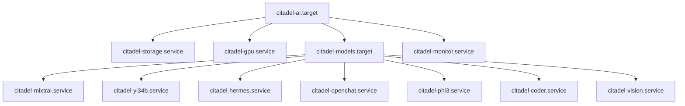
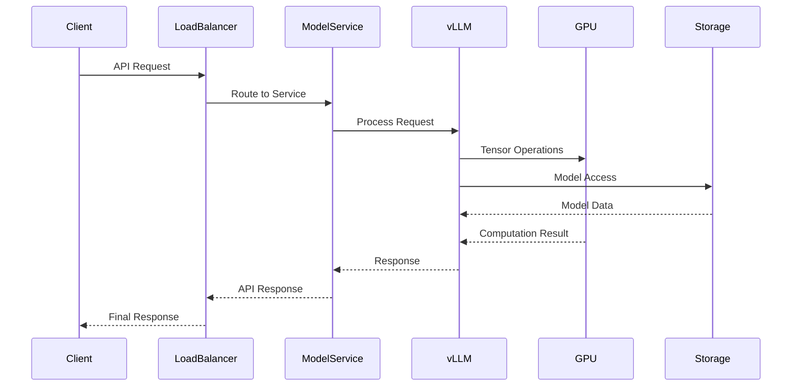

# Citadel AI LLM Server Architecture Document - Outline

**Document Purpose**: Comprehensive technical architecture reference for implementation teams  
**Target Audience**: Technical teams implementing, maintaining, or extending the Citadel AI LLM server  
**Created**: July 1, 2025  
**Version**: 1.0  

## Document Structure Overview

```mermaid
graph TD
    A[Citadel AI LLM Server Architecture] --> B[1. System Overview]
    A --> C[2. Infrastructure Layer]
    A --> D[3. vLLM Framework Layer]
    A --> E[4. Service Architecture]
    A --> F[5. Storage & Data Management]
    A --> G[6. Configuration Management]
    A --> H[7. Monitoring & Operations]
    A --> I[8. Security & Backup]
    A --> J[9. Network Architecture]
    A --> K[10. Component Interactions]
    A --> L[11. Data Flow Diagrams]
    A --> M[12. Deployment Procedures]
    A --> N[13. Operational Runbooks]

    B --> B1[Hardware Specifications]
    B --> B2[Software Stack Overview]
    B --> B3[Performance Characteristics]
    
    C --> C1[Ubuntu 24.04 LTS Foundation]
    C --> C2[NVIDIA Driver Stack]
    C --> C3[Python 3.12 Environment]
    C --> C4[System Dependencies]
    
    D --> D1[vLLM 0.6.1+ Framework]
    D --> D2[Model Management]
    D --> D3[GPU Acceleration]
    D --> D4[API Server Components]
    
    E --> E1[Systemd Service Hierarchy]
    E --> E2[Model Service Instances]
    E --> E3[Health Monitoring Services]
    E --> E4[Load Balancing Strategy]
    
    F --> F1[Storage Hierarchy Design]
    F --> F2[Symlink Management]
    F --> F3[Backup Architecture]
    F --> F4[Data Integrity Systems]
</mermaid>

## 1. System Overview
### 1.1 Hardware Specifications
- **Target Server**: Dell Precision 3630 Tower (dev-ops, 192.168.10.36)
- **GPU**: RTX 4070 Ti SUPER (16GB VRAM)
- **CPU**: High-performance multi-core processor
- **RAM**: 128GB (large context processing)
- **Storage**: 3.6TB NVMe (models) + 7.3TB HDD (backup)

### 1.2 Software Stack Overview
- **OS**: Ubuntu Server 24.04 LTS
- **Python**: 3.12 with latest vLLM compatibility
- **vLLM**: 0.6.1+ framework
- **NVIDIA**: Driver 570.x series with CUDA 12.4+
- **Services**: Systemd-managed service hierarchy

### 1.3 Performance Characteristics
- **Model Support**: 7B-34B parameter models
- **Concurrent Models**: 7 model services (ports 11400-11500)
- **API Compatibility**: OpenAI-compatible endpoints
- **Throughput**: Optimized for GPU acceleration

## 2. Infrastructure Layer
### 2.1 Ubuntu 24.04 LTS Foundation
- Installation procedures (PLANB-01)
- Kernel optimization
- System service configuration

### 2.2 NVIDIA Driver Stack  
- Driver 570.x installation (PLANB-03)
- CUDA 12.4+ integration
- GPU optimization settings

### 2.3 Python 3.12 Environment
- Virtual environment setup (PLANB-04)
- Package management with `/opt/citadel/dev-env`
- Dependency resolution

### 2.4 System Dependencies
- Build tools and compilation environment
- System libraries and runtime dependencies
- Security and access control

## 3. vLLM Framework Layer
### 3.1 vLLM 0.6.1+ Framework
```mermaid
graph TB
    A[vLLM Framework Architecture] --> B[Configuration Layer]
    A --> C[Model Loading Layer]
    A --> D[Inference Engine]
    A --> E[API Server Layer]
    
    B --> B1[Pydantic Settings]
    B --> B2[Environment Variables]
    B --> B3[YAML Configurations]
    
    C --> C1[HuggingFace Integration]
    C --> C2[Model Cache Management]
    C --> C3[GPU Memory Allocation]
    
    D --> D1[Tensor Parallel Processing]
    D --> D2[GPU Acceleration]
    D --> D3[Memory Optimization]
    
    E --> E1[OpenAI Compatible API]
    E --> E2[Health Endpoints]
    E --> E3[Metrics Endpoints]
```

### 3.2 Model Management
- HuggingFace integration with token automation
- Model loading and caching strategies
- Memory management and optimization

### 3.3 GPU Acceleration
- RTX 4070 Ti SUPER optimization
- Tensor parallel processing
- Memory utilization strategies

### 3.4 API Server Components
- OpenAI-compatible REST API
- Health and metrics endpoints
- Request routing and load balancing

## 4. Service Architecture
### 4.1 Systemd Service Hierarchy


### 4.2 Model Service Instances
- Individual model service configuration
- Port allocation strategy (11400-11500)
- Resource allocation per service

### 4.3 Health Monitoring Services
- Service health monitoring
- Automatic restart policies
- Failure detection and recovery

### 4.4 Load Balancing Strategy
- Request distribution across models
- Resource utilization optimization
- Performance monitoring

## 5. Storage & Data Management
### 5.1 Storage Hierarchy Design
```mermaid
graph LR
    A[Storage Architecture] --> B[NVMe Model Storage]
    A --> C[HDD Backup Storage]
    A --> D[Symlink Management]
    
    B --> B1[/mnt/citadel-models<br/>3.6TB NVMe]
    B1 --> B2[/active - Live Models]
    B1 --> B3[/cache - HF Cache]
    B1 --> B4[/downloads - Staging]
    
    C --> C1[/mnt/citadel-backup<br/>7.3TB HDD]
    C1 --> C2[/models - Model Backups]
    C1 --> C3[/system - Config Backups]
    C1 --> C4[/logs - Log Archives]
    
    D --> D1[/opt/citadel/models → /mnt/citadel-models/active]
    D --> D2[Model Convenience Links]
    D --> D3[Cache Symlinks]
```

### 5.2 Symlink Management
- Centralized model access patterns
- Convenience link creation
- Cache symlink optimization

### 5.3 Backup Architecture
- Multi-tier backup strategy (daily/weekly/monthly)
- Incremental backup with deduplication
- Backup verification and integrity checking

### 5.4 Data Integrity Systems
- Checksum verification
- Corruption detection
- Recovery procedures

## 6. Configuration Management
### 6.1 Pydantic-Based Settings
- Centralized configuration validation
- Type-safe configuration management
- Environment variable integration

### 6.2 Configuration Hierarchy
- System-level configuration
- Service-specific settings
- Model-specific parameters

### 6.3 Dynamic Configuration Updates
- Runtime configuration changes
- Service reload procedures
- Configuration validation pipeline

## 7. Monitoring & Operations
### 7.1 Monitoring Stack
- Real-time metrics collection
- Performance monitoring dashboards
- System health monitoring

### 7.2 Alerting System
- Threshold-based alerting
- Alert routing and notification
- Escalation procedures

### 7.3 Log Management
- Centralized log collection
- Log rotation and retention
- Log analysis and search

## 8. Security & Backup
### 8.1 Access Control
- User and service permissions
- Network security configurations
- API authentication and authorization

### 8.2 Backup & Recovery
- Comprehensive backup strategy
- Recovery procedures and testing
- Disaster recovery planning

### 8.3 Security Monitoring
- Security event monitoring
- Intrusion detection
- Vulnerability management

## 9. Network Architecture
### 9.1 Hana-X Lab Integration
- Network topology overview
- Service discovery and communication
- Load balancing and routing

### 9.2 Port Allocation
- Model service ports (11400-11500)
- Management and monitoring ports
- Network security considerations

### 9.3 API Gateway
- Request routing and load balancing
- API versioning and compatibility
- Rate limiting and throttling

## 10. Component Interactions
### 10.1 Service Communication Patterns
- Inter-service communication
- Message passing and event handling
- Error propagation and handling

### 10.2 Data Flow Patterns
- Request processing pipeline
- Model loading and caching
- Response generation and delivery

## 11. Data Flow Diagrams
### 11.1 Request Processing Flow


### 11.2 Model Loading Flow
- Model discovery and selection
- Cache management and optimization
- Memory allocation and loading

### 11.3 Monitoring Data Flow
- Metrics collection pipeline
- Alert generation and routing
- Dashboard data aggregation

## 12. Deployment Procedures
### 12.1 Installation Workflow (PLANB-01 through PLANB-08)
- Sequential task execution
- Validation checkpoints
- Rollback procedures

### 12.2 Service Deployment
- Incremental deployment strategy
- Service startup sequences
- Health check validation

### 12.3 Model Deployment
- Model installation procedures
- Service configuration updates
- Performance validation

## 13. Operational Runbooks
### 13.1 Service Management
- Start/stop/restart procedures
- Health monitoring and diagnostics
- Performance optimization

### 13.2 Troubleshooting Procedures
- Common issue resolution
- Diagnostic command sequences
- Recovery procedures

### 13.3 Maintenance Procedures
- Regular maintenance tasks
- Update and upgrade procedures
- Backup verification and testing

---

## Key Mermaid Diagrams to Include

1. **Overall System Architecture**: Complete component overview
2. **vLLM Framework Deep Dive**: Internal component relationships
3. **Service Architecture**: Systemd service hierarchy and dependencies
4. **Storage Architecture**: File system layout and symlink structure
5. **Data Flow**: Request processing pipeline with sequence diagrams
6. **Network Topology**: Hana-X Lab integration and port allocation
7. **Monitoring Flow**: Metrics collection and alerting pipeline
8. **Backup Architecture**: Data protection and recovery strategy
9. **Configuration Flow**: Settings management and validation
10. **Deployment Sequence**: Installation and service startup workflow

## Technical Focus Areas

- **Performance Optimization**: GPU utilization, memory management, throughput
- **Reliability**: Service restart, health monitoring, failure recovery
- **Scalability**: Multi-model serving, resource allocation, load balancing
- **Maintainability**: Configuration management, logging, monitoring
- **Security**: Access control, API security, network protection
- **Operations**: Service management, troubleshooting, maintenance

---

**Next Steps**: Create the comprehensive technical architecture document based on this outline with detailed implementation specifics and complete Mermaid diagram coverage.