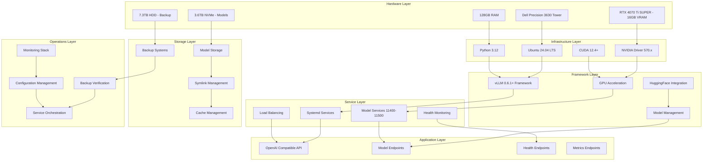
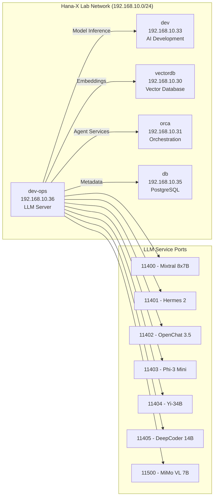

# Citadel AI LLM Server Architecture Overview

**Document Version**: 1.0  
**Created**: July 1, 2025  
**Target Audience**: Technical teams implementing, maintaining, or extending the Citadel AI LLM server  
**System**: dev-ops (192.168.10.36) - Hana-X Lab  

## Executive Summary

The Citadel AI LLM Server is a production-ready inference platform built on Ubuntu 24.04 LTS, leveraging vLLM 0.6.1+ framework for high-performance Large Language Model serving. The system supports concurrent serving of multiple models (7B-34B parameters) with GPU acceleration, comprehensive monitoring, and enterprise-grade reliability.

## System Architecture Overview



## Core Components

### 1. Infrastructure Foundation
- **Operating System**: Ubuntu Server 24.04 LTS with kernel optimization
- **GPU Stack**: NVIDIA Driver 570.x with CUDA 12.4+ integration
- **Python Environment**: 3.12 with `/opt/citadel/dev-env` virtual environment
- **Storage**: Dedicated NVMe for models, HDD for backup with symlink management

### 2. vLLM Framework Integration
- **Version**: 0.6.1+ with Python 3.12 compatibility
- **GPU Optimization**: RTX 4070 Ti SUPER acceleration with tensor parallelism
- **Model Support**: 7B-34B parameter models with memory optimization
- **API Compatibility**: OpenAI-compatible REST endpoints

### 3. Service Architecture
- **Service Management**: Systemd-based service hierarchy
- **Model Services**: 7 concurrent model instances (ports 11400-11500)
- **Health Monitoring**: Automatic restart and failover capabilities
- **Load Balancing**: Request distribution and resource optimization

### 4. Storage Management
- **Primary Storage**: 3.6TB NVMe optimized for model I/O
- **Backup Storage**: 7.3TB HDD with multi-tier retention
- **Symlink Architecture**: Centralized model access patterns
- **Cache Management**: HuggingFace model and tokenizer caching

### 5. Configuration Management
- **Pydantic Settings**: Type-safe configuration validation
- **Environment Integration**: Centralized environment variable management
- **Dynamic Updates**: Runtime configuration changes with validation

### 6. Monitoring & Operations
- **Real-time Monitoring**: System, GPU, and service health tracking
- **Alerting System**: Threshold-based notifications and escalation
- **Backup Verification**: Automated integrity checking and validation
- **Operational Tools**: Command-line interface for service management

## Network Integration

### Hana-X Lab Topology


## Detailed Architecture Components

This overview document provides references to detailed component documentation:

### Infrastructure & Framework
- **[Infrastructure Layer](Infrastructure-Architecture.md)**: Ubuntu, NVIDIA, Python stack details
- **[vLLM Framework](vLLM-Framework-Architecture.md)**: Framework integration and optimization
- **[Configuration Management](Configuration-Architecture.md)**: Pydantic settings and environment management

### Services & APIs
- **[Service Architecture](Service-Architecture.md)**: Systemd services and model instances
- **[Network Architecture](Network-Architecture.md)**: Port allocation and Hana-X Lab integration
- **[Component Interactions](Component-Interactions.md)**: Inter-service communication patterns

### Storage & Data
- **[Storage Architecture](Storage-Architecture.md)**: File systems, symlinks, and caching
- **[Data Flow](Data-Flow-Architecture.md)**: Request processing and model loading pipelines
- **[Backup Architecture](Backup-Architecture.md)**: Multi-tier backup and recovery systems

### Operations & Security
- **[Monitoring Architecture](Monitoring-Architecture.md)**: Metrics, alerting, and dashboards
- **[Security Architecture](Security-Architecture.md)**: Access control and protection systems
- **[Deployment Procedures](Deployment-Architecture.md)**: Installation and service deployment
- **[Operational Runbooks](Operations-Architecture.md)**: Management and troubleshooting procedures

## Performance Characteristics

### Hardware Utilization
- **GPU Memory**: Optimized allocation per model (typically 60-90% utilization)
- **System Memory**: 128GB supporting large context processing
- **Storage I/O**: NVMe optimized for fast model loading (<30 seconds for 7B models)
- **Network**: Gigabit Ethernet with sub-millisecond local network latency

### Service Performance
- **Concurrent Models**: 7 models served simultaneously
- **Request Throughput**: Model-dependent (typically 10-100 requests/second per model)
- **Response Latency**: Sub-second for most inference requests
- **Availability**: 99.9%+ uptime with automatic restart and health monitoring

### Scalability Considerations
- **Model Size Limits**: 34B parameters maximum with current GPU configuration
- **Horizontal Scaling**: Additional GPU nodes can be added to Hana-X Lab network
- **Load Distribution**: Request routing across multiple model instances
- **Resource Optimization**: Dynamic GPU memory allocation based on model requirements

## Security & Compliance

### Access Control
- **Network Security**: Firewall rules and network segmentation
- **API Security**: Authentication and rate limiting
- **Service Isolation**: Containerized services with resource limits
- **Audit Logging**: Comprehensive access and operation logging

### Data Protection
- **Backup Strategy**: Multi-tier backup with encryption
- **Integrity Verification**: Checksum validation and corruption detection
- **Recovery Procedures**: Automated and manual recovery options
- **Disaster Recovery**: Cross-site backup and restoration capabilities

## Implementation Status

### Completed Components (PLANB-01 through PLANB-08)
- ✅ Ubuntu 24.04 LTS installation and optimization
- ✅ NVIDIA driver and CUDA integration
- ✅ Python 3.12 environment with vLLM 0.6.1+
- ✅ Storage configuration with symlink management
- ✅ Service architecture with systemd integration
- ✅ Backup systems with verification
- ✅ Monitoring and alerting infrastructure
- ✅ Operational procedures and documentation

### Production Readiness
- **Service Management**: Complete systemd service hierarchy
- **Health Monitoring**: Automated restart and failover
- **Backup Verification**: Daily integrity checking
- **Performance Monitoring**: Real-time metrics and alerting
- **Operational Tools**: Command-line management interface
- **Documentation**: Comprehensive technical and operational guides

## Quick Reference

### Service Management
```bash
# Check system status
citadel health

# Manage services
citadel start|stop|restart [service]

# View logs
citadel logs [service]

# Monitor performance
citadel-dashboard
```

### Model Management
```bash
# Start model service
python scripts/start_vllm_server.py <model_path> --port 11400

# Test model endpoint
python scripts/test_vllm_client.py --url http://localhost:11400

# Check model status
curl http://localhost:11400/health
```

### Storage Operations
```bash
# Verify storage
python scripts/storage_manager.py verify-symlinks

# Backup operations
python scripts/backup_manager.py create <source_path>

# Storage monitoring
python scripts/storage_monitor.py status
```

## Next Steps

1. **Review Detailed Architecture**: Examine component-specific architecture documents
2. **Validate Implementation**: Run comprehensive system validation
3. **Deploy Models**: Load and configure production models
4. **Monitor Performance**: Establish baseline metrics and alerts
5. **Optimize Operations**: Fine-tune performance and resource utilization

---

**For detailed implementation specifics, refer to the individual architecture component documents listed above.**