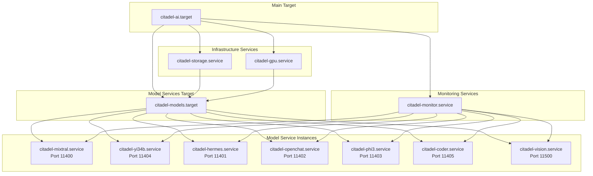
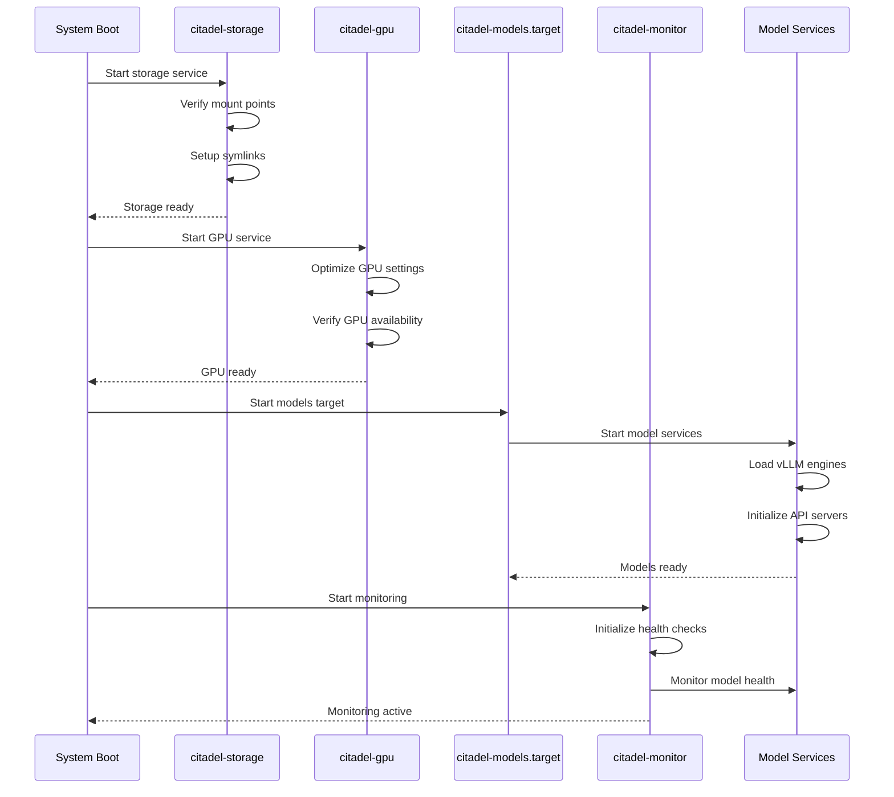
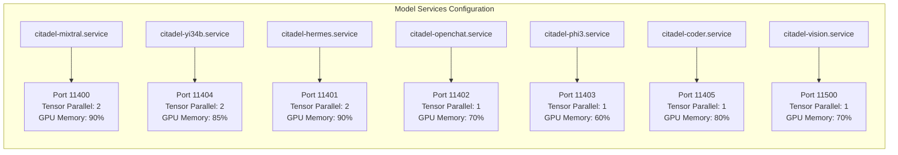
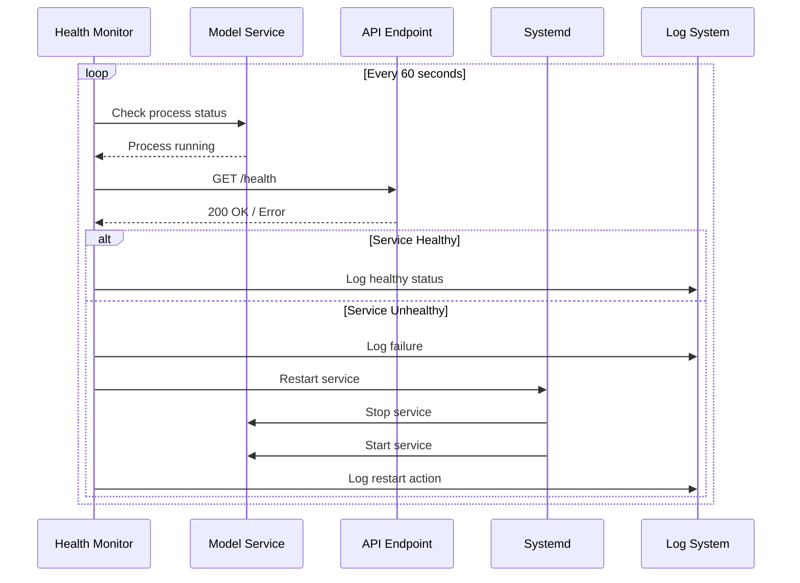
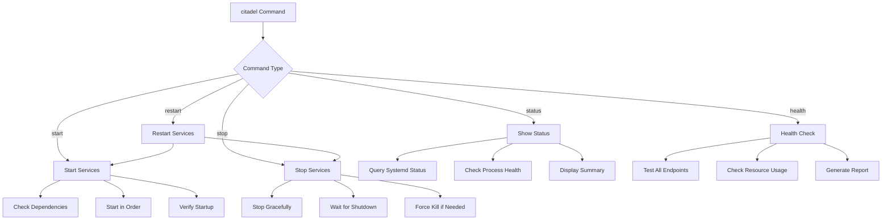
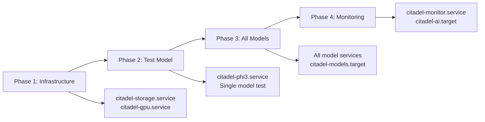
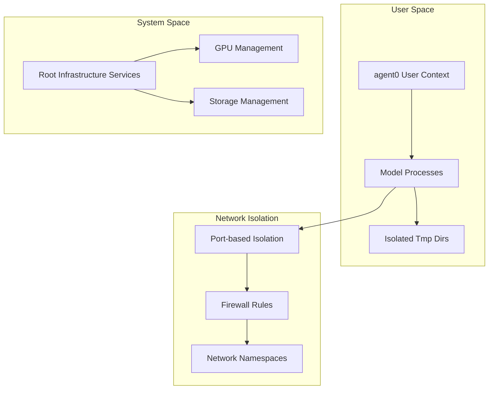
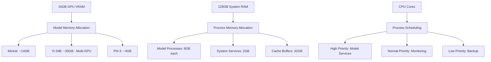

# Service Architecture

**Component**: Systemd Service Management  
**Integration**: Citadel AI LLM Server  
**Document Version**: 1.0  
**Created**: July 1, 2025  
**Dependencies**: vLLM Framework, Storage Management  

## Service Overview

The Citadel AI LLM Server employs a hierarchical systemd service architecture that provides automated management, health monitoring, and graceful startup/shutdown of all system components. The service layer orchestrates infrastructure services, model instances, and monitoring systems with comprehensive dependency management and failure recovery.

## Service Hierarchy Architecture



## Service Dependency Chain



## Infrastructure Services

### Storage Service (`citadel-storage.service`)
```yaml
[Unit]
Description=Citadel AI Storage Verification and Setup
After=local-fs.target
Requires=local-fs.target
Before=citadel-models.target

[Service]
Type=oneshot
RemainAfterExit=yes
User=root
Group=root
EnvironmentFile=/etc/systemd/system/citadel-ai.env
ExecStart=/opt/citadel/services/scripts/storage-setup.sh
ExecStop=/opt/citadel/services/scripts/storage-cleanup.sh
TimeoutStartSec=120
TimeoutStopSec=60

[Install]
WantedBy=citadel-ai.target
```

#### Storage Service Functions
1. **Mount Point Verification**: Ensures `/mnt/citadel-models` and `/mnt/citadel-backup` are mounted
2. **Symlink Validation**: Verifies `/opt/citadel/models` → `/mnt/citadel-models/active` links
3. **Directory Creation**: Creates necessary cache and staging directories
4. **Permission Setting**: Establishes proper ownership and permissions

### GPU Service (`citadel-gpu.service`)
```yaml
[Unit]
Description=Citadel AI GPU Optimization and Monitoring
After=nvidia-persistenced.service
Requires=nvidia-persistenced.service
Before=citadel-models.target

[Service]
Type=oneshot
RemainAfterExit=yes
User=root
Group=root
EnvironmentFile=/etc/systemd/system/citadel-ai.env
ExecStart=/opt/citadel/scripts/gpu-optimize.sh
ExecStop=/opt/citadel/scripts/gpu-restore.sh
TimeoutStartSec=60
TimeoutStopSec=30

[Install]
WantedBy=citadel-ai.target
```

#### GPU Service Functions
1. **GPU Optimization**: Sets performance profiles and power limits
2. **Memory Management**: Configures GPU memory allocation strategies
3. **Driver Verification**: Ensures NVIDIA drivers and CUDA are functional
4. **Thermal Management**: Establishes thermal monitoring and protection

## Model Service Architecture

### Model Service Template
```yaml
[Unit]
Description=Citadel AI Model Service - {MODEL_NAME}
PartOf=citadel-models.target
After=citadel-storage.service citadel-gpu.service
Requires=citadel-storage.service citadel-gpu.service

[Service]
Type=simple
User=agent0
Group=agent0
WorkingDirectory=/opt/citadel
EnvironmentFile=/etc/systemd/system/citadel-ai.env
Environment=MODEL_NAME={MODEL_NAME}
Environment=MODEL_PORT={MODEL_PORT}
Environment=MODEL_PATH={MODEL_PATH}

# Resource limits
LimitNOFILE=65536
LimitNPROC=32768
LimitMEMLOCK=infinity

# Service configuration
ExecStart=/opt/citadel/services/scripts/start-model.sh {MODEL_NAME}
ExecStop=/opt/citadel/services/scripts/stop-model.sh {MODEL_NAME}
ExecReload=/bin/kill -HUP $MAINPID

# Restart configuration
Restart=always
RestartSec=30
StartLimitInterval=300
StartLimitBurst=3

# Logging
StandardOutput=journal
StandardError=journal
SyslogIdentifier=citadel-{MODEL_NAME}

# Security settings
NoNewPrivileges=true
ProtectSystem=strict
ProtectHome=true
ReadWritePaths=/opt/citadel /mnt/citadel-models /tmp
PrivateTmp=true

[Install]
WantedBy=citadel-models.target
```

### Model Service Instances



### Model Service Startup Scripts

The `start-model.sh` script implements model-specific configuration:

```bash
#!/bin/bash
# start-model.sh - Start individual model service

case "$MODEL_NAME" in
    mixtral)
        MODEL_PATH="/opt/citadel/models/mixtral-8x7b-instruct"
        PORT=11400
        TENSOR_PARALLEL=2
        GPU_MEMORY=0.90
        MAX_MODEL_LEN=32768
        ;;
    yi34b)
        MODEL_PATH="/opt/citadel/models/yi-34b-chat"
        PORT=11404
        TENSOR_PARALLEL=2
        GPU_MEMORY=0.85
        MAX_MODEL_LEN=4096
        ;;
    # Additional model configurations...
esac

# Start vLLM server with optimized parameters
exec python -m vllm.entrypoints.openai.api_server \
    --model "$MODEL_PATH" \
    --host "0.0.0.0" \
    --port "$PORT" \
    --tensor-parallel-size "$TENSOR_PARALLEL" \
    --gpu-memory-utilization "$GPU_MEMORY" \
    --max-model-len "$MAX_MODEL_LEN" \
    --served-model-name "$MODEL_NAME" \
    --trust-remote-code \
    --enable-chunked-prefill \
    --enable-prefix-caching \
    --disable-log-stats
```

## Health Monitoring Architecture

### Health Monitor Service (`citadel-monitor.service`)
```yaml
[Unit]
Description=Citadel AI Health Monitoring Service
After=citadel-models.target
Requires=citadel-models.target

[Service]
Type=simple
User=agent0
Group=agent0
WorkingDirectory=/opt/citadel
EnvironmentFile=/etc/systemd/system/citadel-ai.env
ExecStart=/opt/citadel/services/scripts/health-monitor.sh

# Restart configuration
Restart=always
RestartSec=60

# Logging
StandardOutput=journal
StandardError=journal
SyslogIdentifier=citadel-monitor

[Install]
WantedBy=citadel-ai.target
```

### Health Monitoring Flow


### Health Check Implementation
```bash
#!/bin/bash
# health-monitor.sh - Continuous health monitoring

MONITOR_INTERVAL=60
declare -A MODEL_PORTS=(
    ["mixtral"]=11400
    ["yi34b"]=11404
    ["hermes"]=11401
    ["openchat"]=11402
    ["phi3"]=11403
    ["coder"]=11405
    ["vision"]=11500
)

check_service_health() {
    local model_name="$1"
    local port="$2"
    
    if curl -s "http://localhost:$port/health" > /dev/null 2>&1; then
        return 0
    else
        return 1
    fi
}

restart_service() {
    local service_name="$1"
    log_message "Restarting service: $service_name"
    systemctl restart "$service_name" || log_message "Failed to restart $service_name"
}

while true; do
    for model_name in "${!MODEL_PORTS[@]}"; do
        port="${MODEL_PORTS[$model_name]}"
        
        if check_service_health "$model_name" "$port"; then
            log_message "✅ $model_name (port $port) - healthy"
        else
            log_message "❌ $model_name (port $port) - unhealthy"
            restart_service "citadel-$model_name.service"
        fi
    done
    
    sleep "$MONITOR_INTERVAL"
done
```

## Service Management Tools

### Citadel Service Control Script
The `citadel-service.sh` script provides unified service management:

```bash
#!/bin/bash
# citadel-service.sh - Citadel AI service management

Commands:
  start [service]     - Start all services or specific service
  stop [service]      - Stop all services or specific service
  restart [service]   - Restart all services or specific service
  status [service]    - Show status of all services or specific service
  logs [service]      - Show logs for all services or specific service
  enable              - Enable all services for auto-start
  disable             - Disable auto-start for all services
  health              - Run health check on all services

Service names:
  all, storage, gpu, models, monitor
  mixtral, yi34b, hermes, openchat, phi3, coder, vision
```

### Service Management Flow


## Incremental Deployment Strategy

### Phased Service Deployment


### Deployment Script (`citadel-deploy`)
```bash
#!/bin/bash
# deploy-services.sh - Incremental service deployment

deploy_phase1() {
    echo "=== Phase 1: Infrastructure Services ==="
    sudo systemctl enable citadel-storage.service
    sudo systemctl start citadel-storage.service
    sudo systemctl enable citadel-gpu.service
    sudo systemctl start citadel-gpu.service
    echo "✅ Phase 1 completed successfully"
}

deploy_phase2() {
    local test_model="${1:-phi3}"
    echo "=== Phase 2: Test Model Service ==="
    sudo systemctl enable "citadel-$test_model.service"
    sudo systemctl start "citadel-$test_model.service"
    # Test model endpoint
    if curl -s "http://localhost:11403/health" > /dev/null; then
        echo "✅ Phase 2 completed successfully"
    else
        echo "❌ Model endpoint test failed"
        exit 1
    fi
}
```

## Service Security and Isolation

### Security Configuration
```yaml
# Security settings for model services
[Service]
# Process isolation
NoNewPrivileges=true
ProtectSystem=strict
ProtectHome=true
ReadWritePaths=/opt/citadel /mnt/citadel-models /tmp
PrivateTmp=true

# Resource limits
LimitNOFILE=65536
LimitNPROC=32768
LimitMEMLOCK=infinity

# User isolation
User=agent0
Group=agent0
```

### Service Isolation Architecture


## Performance and Resource Management

### Resource Allocation Strategy


### Service Performance Monitoring
- **CPU Usage**: Per-service CPU utilization tracking
- **Memory Usage**: RAM and GPU memory monitoring
- **Network I/O**: Request/response metrics per service
- **Disk I/O**: Model loading and cache access patterns
- **Service Health**: Endpoint availability and response times

## Troubleshooting and Diagnostics

### Service Debugging Commands
```bash
# Check service status
systemctl status citadel-mixtral.service

# View service logs
journalctl -u citadel-mixtral.service -f

# Test service endpoint
curl -X POST http://localhost:11400/v1/chat/completions \
  -H "Content-Type: application/json" \
  -d '{"model": "mixtral", "messages": [{"role": "user", "content": "Hello"}]}'

# Check resource usage
systemctl show citadel-mixtral.service --property=MainPID
ps -p <PID> -o pid,ppid,cmd,%mem,%cpu

# Monitor GPU usage
nvidia-smi -l 1
```

### Common Service Issues
1. **Service Start Failures**: Check dependencies, permissions, and configuration
2. **Port Conflicts**: Verify port availability and network configuration
3. **Memory Issues**: Monitor GPU memory allocation and system RAM usage
4. **Performance Problems**: Check CPU/GPU utilization and thermal throttling

## Integration with Other Components

### Framework Integration
- **vLLM Framework**: Services start vLLM processes with optimized parameters
- **Configuration Management**: Services load settings from Pydantic configurations
- **Storage Management**: Services depend on storage verification and symlink setup

### Monitoring Integration
- **Health Endpoints**: All model services expose `/health` and `/metrics` endpoints
- **Log Aggregation**: Systemd journal integration with centralized logging
- **Alerting System**: Service failures trigger automatic restart and notification

---

**Related Components**: [vLLM Framework Architecture](vLLM-Framework-Architecture.md), [Storage Architecture](Storage-Architecture.md), [Monitoring Architecture](Monitoring-Architecture.md)