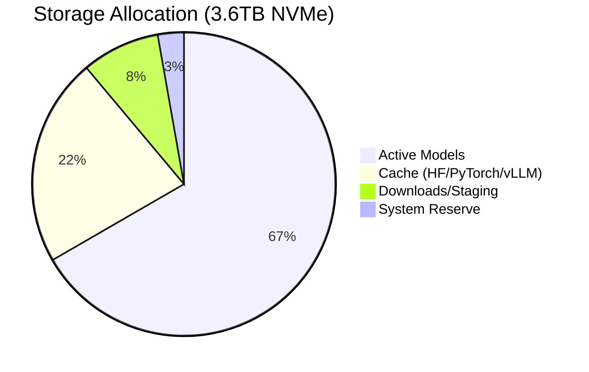
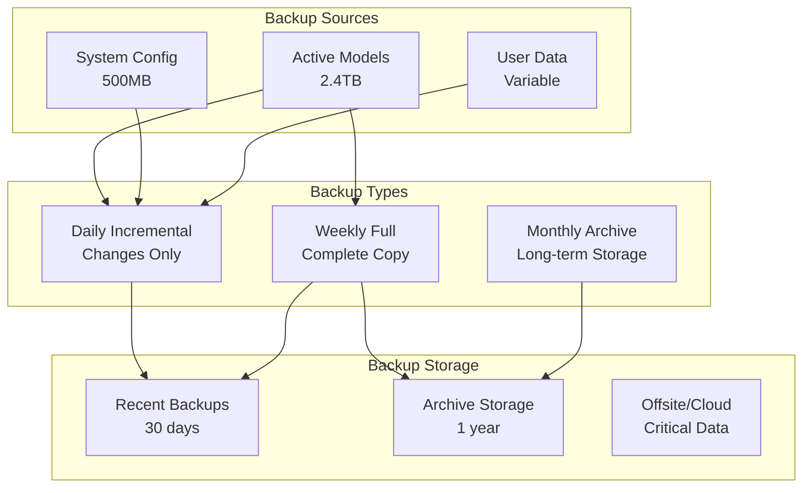

# Storage Architecture
**Citadel Alpha LLM Server - Storage Infrastructure Design**

## Executive Summary

The Citadel Alpha LLM Server employs a sophisticated multi-tier storage architecture optimized for large language model operations on Dell Precision 3630 Tower hardware. This design combines high-performance NVMe SSD storage (3.6TB) for active model data with high-capacity HDD storage (7.3TB) for backup and archival, unified through an intelligent symlink management system and comprehensive backup strategy.

## Architecture Overview

```mermaid
graph TB
    subgraph "Hardware Layer"
        NVMe[3.6TB NVMe SSD<br/>High Performance]
        HDD[7.3TB HDD<br/>Backup Storage]
    end
    
    subgraph "Mount Points"
        Models[/mnt/citadel-models]
        Backup[/mnt/citadel-backup]
    end
    
    subgraph "Application Layer"
        App[/opt/citadel]
        Symlinks[Symlink Management]
        Cache[ML Framework Cache]
    end
    
    subgraph "Management Layer"
        Storage[Storage Manager]
        Monitor[Storage Monitor] 
        BackupMgr[Backup Manager]
        Orchestrator[Storage Orchestrator]
    end
    
    NVMe --> Models
    HDD --> Backup
    Models --> Symlinks
    Symlinks --> App
    Symlinks --> Cache
    
    Storage --> Models
    Storage --> Symlinks
    Monitor --> Models
    Monitor --> Backup
    BackupMgr --> Backup
    Orchestrator --> Storage
    Orchestrator --> Monitor
    Orchestrator --> BackupMgr
```

## Multi-Tier Storage Design

### Physical Storage Configuration

#### Primary Storage - NVMe SSD (3.6TB)
- **Mount Point**: [`/mnt/citadel-models`](file:///mnt/citadel-models)
- **Purpose**: Active model storage, high-performance operations
- **Filesystem**: ext4 with optimized mount options
- **Performance**: ~3,500 MB/s sequential read, ~3,200 MB/s write
- **Optimization**: [`noatime`](file:///etc/fstab), [`discard`](file:///etc/fstab) mount options for SSD longevity

#### Backup Storage - HDD (7.3TB)  
- **Mount Point**: [`/mnt/citadel-backup`](file:///mnt/citadel-backup)
- **Purpose**: Model backups, system archives, long-term storage
- **Filesystem**: ext4 with standard mount options
- **Performance**: ~250 MB/s sequential operations
- **Features**: SMART monitoring, automated health checks

### Storage Allocation Strategy



#### Directory Structure
```
/mnt/citadel-models/          # NVMe Storage (3.6TB)
├── active/                   # Active model files (2.4TB)
│   ├── Mixtral-8x7B-Instruct-v0.1/
│   ├── Yi-34B-Chat/
│   ├── Nous-Hermes-2-Mixtral-8x7B-DPO/
│   └── [other models]/
├── cache/                    # ML Framework cache (800GB)
│   ├── huggingface/
│   ├── torch/
│   ├── vllm/
│   └── transformers/
├── downloads/                # Download staging (200GB)
├── staging/                  # Model staging (100GB)
└── archive/                  # Archived models (as space allows)

/mnt/citadel-backup/          # HDD Storage (7.3TB)
├── models/                   # Model backups (5TB)
│   ├── daily/
│   ├── weekly/
│   └── monthly/
├── system/                   # System backups (1TB)
└── metadata/                 # Backup metadata (100GB)
```

## Symlink Management System

### Architecture Overview

The symlink system provides a unified interface between the application directory ([`/opt/citadel`](file:///opt/citadel)) and the distributed storage infrastructure, enabling transparent access to models and cache while maintaining flexibility for storage management.

```mermaid
graph LR
    subgraph "Application Directory"
        AppModels[/opt/citadel/models]
        AppDownloads[/opt/citadel/downloads]
        AppStaging[/opt/citadel/staging]
        ModelLinks[/opt/citadel/model-links/]
    end
    
    subgraph "Storage Targets"
        StorageActive[/mnt/citadel-models/active]
        StorageDownloads[/mnt/citadel-models/downloads]
        StorageStaging[/mnt/citadel-models/staging]
        SpecificModels[Model Directories]
    end
    
    subgraph "Cache Integration"
        HFCache[~/.cache/huggingface]
        TorchCache[~/.cache/torch]
        StorageCache[/mnt/citadel-models/cache]
    end
    
    AppModels -.->|symlink| StorageActive
    AppDownloads -.->|symlink| StorageDownloads
    AppStaging -.->|symlink| StorageStaging
    ModelLinks -.->|convenience links| SpecificModels
    HFCache -.->|symlink| StorageCache
    TorchCache -.->|symlink| StorageCache
```

### Primary Application Symlinks

#### Core Directory Links
```bash
# Primary storage symlinks
/opt/citadel/models → /mnt/citadel-models/active
/opt/citadel/downloads → /mnt/citadel-models/downloads  
/opt/citadel/staging → /mnt/citadel-models/staging
```

#### Implementation Details
- **Creation**: Managed by [`StorageManager.create_symlinks()`](scripts/storage_manager.py:150)
- **Verification**: Automated health checks via [`StorageMonitor.check_symlinks()`](scripts/storage_monitor.py:323)
- **Repair**: Automatic repair through [`StorageManager.repair_symlinks()`](scripts/storage_manager.py:280)

### Convenience Model Links

Located in [`/opt/citadel/model-links/`](file:///opt/citadel/model-links/), these provide direct access to specific models:

```bash
# Convenience symlinks for direct model access
/opt/citadel/model-links/mixtral → /mnt/citadel-models/active/Mixtral-8x7B-Instruct-v0.1
/opt/citadel/model-links/yi34b → /mnt/citadel-models/active/Yi-34B-Chat
/opt/citadel/model-links/hermes → /mnt/citadel-models/active/Nous-Hermes-2-Mixtral-8x7B-DPO
/opt/citadel/model-links/openchat → /mnt/citadel-models/active/openchat-3.5-1210
/opt/citadel/model-links/phi3 → /mnt/citadel-models/active/Phi-3-mini-128k-instruct
/opt/citadel/model-links/coder → /mnt/citadel-models/active/deepseek-coder-14b-instruct-v1.5
/opt/citadel/model-links/vision → /mnt/citadel-models/active/imp-v1_5-7b
```

### Cache Directory Integration

#### ML Framework Cache Symlinks
```bash
# Framework cache redirection to high-performance storage
~/.cache/huggingface → /mnt/citadel-models/cache/huggingface
~/.cache/torch → /mnt/citadel-models/cache/torch
~/.cache/transformers → /mnt/citadel-models/cache/transformers
```

#### Environment Variables
Generated automatically by [`get_storage_environment_variables()`](configs/storage_settings.py:461):
```bash
export HF_HOME="/mnt/citadel-models/cache/huggingface"
export HUGGINGFACE_HUB_CACHE="/mnt/citadel-models/cache/huggingface"  
export TRANSFORMERS_CACHE="/mnt/citadel-models/cache/transformers"
export TORCH_HOME="/mnt/citadel-models/cache/torch"
export VLLM_CACHE_ROOT="/mnt/citadel-models/cache/vllm"
```

### Automated Health Management

#### Health Monitoring
- **Check Interval**: 300 seconds (configurable via [`SYMLINK_HEALTH_CHECK_INTERVAL`](configs/storage_settings.py:185))
- **Broken Link Detection**: Automatic identification of invalid targets
- **Repair Actions**: Automatic recreation of broken symlinks

#### Configuration Management
Symlink behavior controlled via [`SymlinkSettings`](configs/storage_settings.py:153):
```python
# Key configuration options
SYMLINK_FORCE_RECREATE=false          # Force recreation of existing links
SYMLINK_VERIFY_TARGETS=true           # Verify targets before creation
SYMLINK_CREATE_MISSING_TARGETS=true   # Create missing target directories
SYMLINK_REPAIR_BROKEN_LINKS=true      # Auto-repair broken symlinks
```

## Backup & Recovery Architecture

### Multi-Tier Backup Strategy

The backup system implements a comprehensive three-tier strategy designed for data protection, performance, and storage efficiency.



### Backup Implementation

#### Backup Jobs
Managed by [`BackupManager`](scripts/backup_manager.py:61) with comprehensive job tracking:
```python
@dataclass
class BackupJob:
    job_id: str
    source_path: str
    destination_path: str
    backup_type: str  # full, incremental
    status: str       # pending, running, completed, failed
    files_processed: int
    bytes_processed: int
    checksum: str     # Integrity verification
```

#### Backup Schedules
Configured via [`BackupSettings.backup_types`](configs/storage_settings.py:375):
```python
backup_types = {
    "daily": "0 2 * * *",      # 2 AM daily
    "weekly": "0 3 * * 0",     # 3 AM Sunday
    "monthly": "0 4 1 * *"     # 4 AM 1st of month
}
```

### Incremental Backup with Hard Links

#### Technology Stack
- **Primary Tool**: [`rsync`](https://rsync.samba.org/) with [`--link-dest`](https://linux.die.net/man/1/rsync) option
- **Deduplication**: Hard links for unchanged files
- **Compression**: Configurable (zstd, gzip, lz4)
- **Verification**: MD5 checksums for integrity

#### Implementation Example
```bash
# Incremental backup command
rsync -av --progress --stats \
  --link-dest=/mnt/citadel-backup/models/previous_backup \
  /mnt/citadel-models/active/ \
  /mnt/citadel-backup/models/backup_20250107_143000/
```

### Integrity Verification System

#### Checksum Verification
- **Algorithm**: SHA-256 for critical data, MD5 for performance
- **Sampling**: Configurable verification rate (default 10% of files)
- **Implementation**: [`BackupManager.verify_backup()`](scripts/backup_manager.py:281)

#### Verification Process
```python
# Verification workflow
verification_result = backup_manager.verify_backup(
    backup_path="/mnt/citadel-backup/models/backup_20250107",
    sample_rate=0.1  # Verify 10% of files
)

if verification_result.is_valid:
    logger.info(f"Backup verified: {verification_result.files_checked} files")
else:
    logger.error(f"Backup failed verification: {verification_result.errors}")
```

### Automated Cleanup & Retention

#### Retention Policies
- **Daily Backups**: 30 day retention
- **Weekly Backups**: 12 week retention  
- **Monthly Backups**: 12 month retention
- **Configuration**: [`BACKUP_RETENTION_DAYS`](configs/storage_settings.py:349)

#### Cleanup Implementation
```python
# Automated cleanup
removed_backups = backup_manager.cleanup_old_backups(retention_days=30)
logger.info(f"Cleaned up {len(removed_backups)} old backups")
```

## Performance Optimization

### NVMe SSD Optimization

#### Filesystem Tuning
```bash
# Optimized mount options for NVMe SSD
/dev/nvme0n1p1 /mnt/citadel-models ext4 noatime,discard,data=writeback 0 2
```

#### I/O Scheduler Optimization
```bash
# Set I/O scheduler for optimal NVMe performance
echo mq-deadline > /sys/block/nvme0n1/queue/scheduler
```

### Cache Management Strategy

#### Intelligent Cache Placement
- **Hot Data**: Frequently accessed models on NVMe
- **Warm Data**: Framework cache on NVMe 
- **Cold Data**: Archived models moved to HDD

#### Cache Size Management
```python
# Cache configuration via storage settings
torch_cache_size = 200GB    # PyTorch model cache
hf_cache_size = 400GB       # Hugging Face cache  
vllm_cache_size = 200GB     # vLLM compiled kernels
```

### Performance Monitoring

#### Real-time Metrics
Collected by [`StorageMonitor.get_performance_metrics()`](scripts/storage_monitor.py:259):
- **Read/Write Latency**: Millisecond precision
- **Throughput**: MB/s for sequential operations
- **IOPS**: Operations per second
- **Queue Depth**: Storage queue utilization

#### Performance Thresholds
```python
# Configurable performance alerts
IO_LATENCY_THRESHOLD = 100.0      # milliseconds
THROUGHPUT_THRESHOLD = 100.0      # MB/s minimum
DISK_USAGE_WARNING = 0.8          # 80% usage warning
DISK_USAGE_CRITICAL = 0.9         # 90% usage critical
```

## Monitoring & Health Management

### Real-time Health Monitoring

#### Storage Health Metrics
Comprehensive monitoring via [`StorageMonitor`](scripts/storage_monitor.py:75):

```python
@dataclass
class StorageHealth:
    path: str
    total_space: int
    used_space: int
    free_space: int
    usage_percent: float
    inode_usage_percent: float
    is_healthy: bool
    warnings: List[str]
```

#### Monitoring Components
1. **Disk Space Monitoring**: Real-time usage tracking
2. **Inode Monitoring**: Filesystem metadata usage
3. **Symlink Health**: Broken link detection and repair
4. **Performance Metrics**: I/O latency and throughput
5. **SMART Monitoring**: Disk health and predictive failure

### SMART Disk Health Integration

#### Implementation
```python
# SMART health check
def check_smart_health(self) -> Dict[str, Any]:
    devices = self._get_storage_devices()
    for device in devices:
        result = subprocess.run(
            ["sudo", "smartctl", "-H", device],
            capture_output=True, text=True, timeout=30
        )
        # Process SMART data
```

#### Monitored Attributes
- **Temperature**: Thermal monitoring with alerts
- **Reallocated Sectors**: Bad sector tracking
- **Spin-up Time**: Mechanical health (HDD)
- **Power-on Hours**: Device lifetime tracking
- **Error Rates**: Read/write/seek error monitoring

### Automated Alerting System

#### Alert Integration
- **Local Logging**: Structured logs in [`/opt/citadel/logs/`](file:///opt/citadel/logs/)
- **Prometheus Metrics**: Export to [`192.168.10.36:9090`](http://192.168.10.36:9090)
- **Grafana Dashboards**: Visualization at [`192.168.10.36:3000`](http://192.168.10.36:3000)
- **AlertManager**: Critical alerts via [`192.168.10.36:9093`](http://192.168.10.36:9093)

#### Alert Thresholds
```python
# Configurable alert thresholds
STORAGE_MONITOR_DISK_USAGE_WARNING = 0.8      # 80% disk usage
STORAGE_MONITOR_DISK_USAGE_CRITICAL = 0.9     # 90% disk usage  
STORAGE_MONITOR_GPU_TEMPERATURE_CRITICAL = 80.0  # 80°C GPU temp
STORAGE_MONITOR_IO_LATENCY_THRESHOLD = 100.0    # 100ms I/O latency
```

## Configuration Management

### Pydantic-Based Settings

The storage system uses a comprehensive Pydantic-based configuration system for type-safe, validated settings management.

#### Core Configuration Classes
```python
# Primary configuration structure
class StorageSettings(BaseSettings):
    paths: StoragePathSettings
    models: ModelSettings  
    symlinks: SymlinkSettings
    monitoring: StorageMonitoringSettings
    backup: BackupSettings
```

#### Environment Variable Integration
All settings support environment variable overrides with prefixes:
- **Storage Paths**: [`CITADEL_*`](configs/storage_settings.py:18)
- **Model Settings**: [`MODEL_*`](configs/storage_settings.py:149) 
- **Symlink Behavior**: [`SYMLINK_*`](configs/storage_settings.py:197)
- **Monitor Thresholds**: [`STORAGE_MONITOR_*`](configs/storage_settings.py:334)
- **Backup Policies**: [`BACKUP_*`](configs/storage_settings.py:431)

### Dynamic Configuration Loading

#### Settings Initialization
```python
# Load settings with environment variable support
from storage_settings import load_storage_settings
settings = load_storage_settings()

# Access structured configuration
models_path = settings.paths.models_active
backup_retention = settings.backup.retention_days
monitoring_enabled = settings.monitoring.enable_monitoring
```

#### Environment Script Generation
Automatic generation of shell environment via [`get_storage_environment_variables()`](configs/storage_settings.py:461):
```bash
# Generated environment script: /opt/citadel/configs/storage-env.sh
export CITADEL_MODELS_ROOT="/mnt/citadel-models"
export CITADEL_MODELS_ACTIVE="/mnt/citadel-models/active"
export CITADEL_MODEL_MIXTRAL="/mnt/citadel-models/active/Mixtral-8x7B-Instruct-v0.1"
export HF_HOME="/mnt/citadel-models/cache/huggingface"
```

## Operational Procedures

### Setup & Initialization

#### Automated Setup
Complete storage system initialization via [`StorageOrchestrator`](scripts/storage_orchestrator.py:29):
```bash
# Single command complete setup
python3 scripts/storage_orchestrator.py setup

# Verify setup
python3 scripts/storage_orchestrator.py status --json
```

#### Manual Component Setup
```bash
# Individual component management
python3 scripts/storage_manager.py verify-prereq
python3 scripts/storage_manager.py create-dirs
python3 scripts/storage_manager.py create-symlinks
python3 scripts/storage_manager.py verify-symlinks
```

### Maintenance Procedures

#### Daily Operations
```bash
# Morning health check
python3 scripts/storage_orchestrator.py status

# Start monitoring (if not running)
python3 scripts/storage_orchestrator.py start-monitor
```

#### Weekly Maintenance
```bash
# Create full backup
python3 scripts/storage_orchestrator.py backup /mnt/citadel-models/active --type full

# Performance check
python3 scripts/storage_monitor.py performance /mnt/citadel-models

# Cleanup old backups
python3 scripts/backup_manager.py cleanup
```

### Emergency Procedures

#### Symlink Repair
```bash
# Emergency symlink repair
python3 scripts/storage_manager.py repair-symlinks

# Force recreation if needed
SYMLINK_FORCE_RECREATE=true python3 scripts/storage_manager.py create-symlinks
```

#### Storage Recovery
```bash
# Emergency backup creation
python3 scripts/backup_manager.py create /mnt/citadel-models/active full

# Verify backup integrity
python3 scripts/backup_manager.py verify /mnt/citadel-backup/models/emergency_backup

# Restore from backup (if needed)
rsync -av /mnt/citadel-backup/models/latest/ /mnt/citadel-models/active/
```

## Integration Points

### vLLM Framework Integration

#### Model Path Resolution
```python
# Integration with vLLM server startup
from storage_settings import load_storage_settings
settings = load_storage_settings()

# Direct model path access
mixtral_path = f"{settings.paths.models_active}/Mixtral-8x7B-Instruct-v0.1"

# Or via environment variables
import os
mixtral_path = os.environ.get("CITADEL_MODEL_MIXTRAL")
```

#### Cache Optimization
```python
# Optimized cache configuration for vLLM
os.environ["VLLM_CACHE_ROOT"] = settings.paths.vllm_cache
os.environ["HF_HOME"] = settings.paths.hf_cache
os.environ["TRANSFORMERS_CACHE"] = settings.paths.transformers_cache
```

### Service Architecture Integration

#### Systemd Service Dependencies
Storage services integrate with the broader systemd service hierarchy:
```ini
# Service dependency example
[Unit]
Description=vLLM Model Server
After=citadel-storage.service
Requires=citadel-storage.service

[Service]
EnvironmentFile=/opt/citadel/configs/storage-env.sh
ExecStart=/opt/citadel/scripts/start_vllm_server.py
```

### Monitoring Stack Integration

#### Prometheus Metrics Export
```python
# Storage metrics for Prometheus
storage_metrics = {
    "citadel_storage_usage_bytes": disk_usage.used,
    "citadel_storage_free_bytes": disk_usage.free,
    "citadel_backup_last_success": last_backup_timestamp,
    "citadel_symlink_health_status": symlink_health_score,
}
```

## Troubleshooting Guide

### Common Issues & Solutions

#### Configuration Loading Errors
```bash
# Verify configuration
python3 -c "from storage_settings import load_storage_settings; print('✅ Config loaded')"

# Check environment variables
env | grep CITADEL_
```

#### Permission Problems
```bash
# Fix ownership issues
sudo chown -R agent0:agent0 /opt/citadel /mnt/citadel-models /mnt/citadel-backup

# Verify permissions
ls -la /opt/citadel/models  # Should show symlink
ls -la /mnt/citadel-models  # Should show target directory
```

#### Performance Issues
```bash
# Performance diagnostics
python3 scripts/storage_monitor.py performance /mnt/citadel-models

# Check I/O scheduler
cat /sys/block/nvme0n1/queue/scheduler

# Monitor real-time I/O
iotop -o
```

#### Backup Failures
```bash
# Check backup status
python3 scripts/backup_manager.py status

# Verify backup integrity
python3 scripts/backup_manager.py verify /mnt/citadel-backup/models/latest_backup

# Emergency backup
python3 scripts/backup_manager.py create /mnt/citadel-models/active full
```

## Capacity Planning & Expansion

### Current Capacity Analysis
- **NVMe Utilization**: ~75% (2.7TB/3.6TB)
- **HDD Utilization**: ~40% (2.9TB/7.3TB) 
- **Growth Rate**: ~200GB/month (new models + cache)
- **Projected Full**: 18 months at current growth

### Expansion Strategies

#### Short-term (6 months)
- Archive older models to HDD storage
- Implement intelligent cache eviction
- Optimize model storage (quantization, pruning)

#### Medium-term (12 months)
- Add secondary NVMe drive (M.2 slot available)
- Implement tiered storage automation
- Expand backup storage capacity

#### Long-term (18+ months)  
- Consider storage server upgrade
- Implement distributed storage architecture
- Cloud storage integration for archives

## Summary

The Citadel Alpha LLM Server storage architecture provides a robust, scalable, and high-performance foundation for large language model operations. Key achievements:

- ✅ **Multi-tier Performance**: Optimized NVMe for active data, HDD for backups
- ✅ **Intelligent Symlinks**: Automated management and health monitoring  
- ✅ **Comprehensive Backups**: Multi-tier strategy with integrity verification
- ✅ **Real-time Monitoring**: Health checks, performance metrics, SMART integration
- ✅ **Pydantic Configuration**: Type-safe, validated settings management
- ✅ **Production Readiness**: Automated operations, error handling, recovery procedures

This architecture ensures optimal performance for vLLM inference workloads while maintaining data protection, system reliability, and operational efficiency for the Citadel AI deployment.

---

**Related Architecture Documents:**
- [`LLM-Server-Architecture-Overview.md`](LLM-Server-Architecture-Overview.md) - System overview and integration
- [`vLLM-Framework-Architecture.md`](vLLM-Framework-Architecture.md) - Model loading and cache optimization
- [`Service-Architecture.md`](Service-Architecture.md) - Systemd integration and service management

**Implementation References:**
- [`storage_settings.py`](../configs/storage_settings.py) - Pydantic configuration classes
- [`storage_orchestrator.py`](../scripts/storage_orchestrator.py) - Complete setup automation
- [`storage_manager.py`](../scripts/storage_manager.py) - Core storage operations  
- [`storage_monitor.py`](../scripts/storage_monitor.py) - Health monitoring system
- [`backup_manager.py`](../scripts/backup_manager.py) - Backup and verification