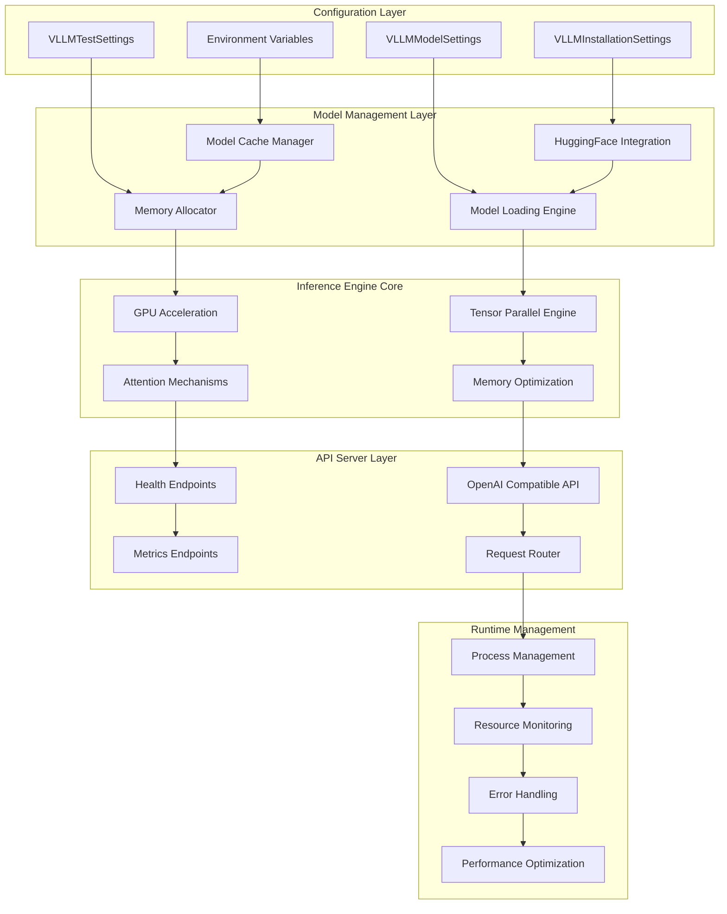
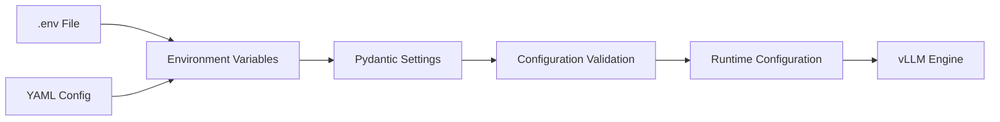
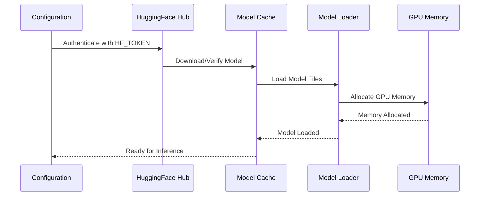
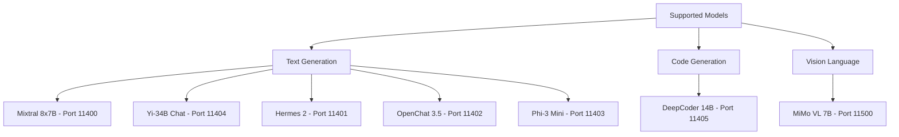
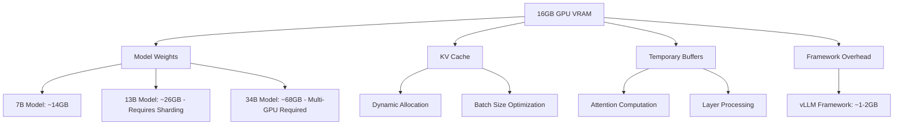
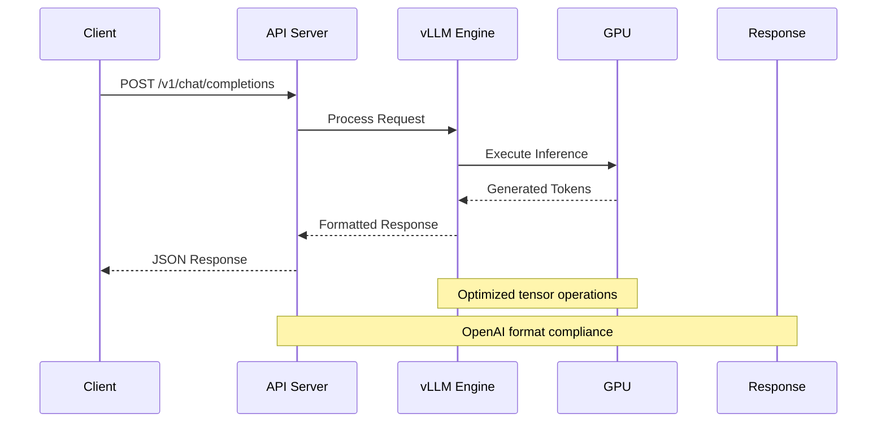
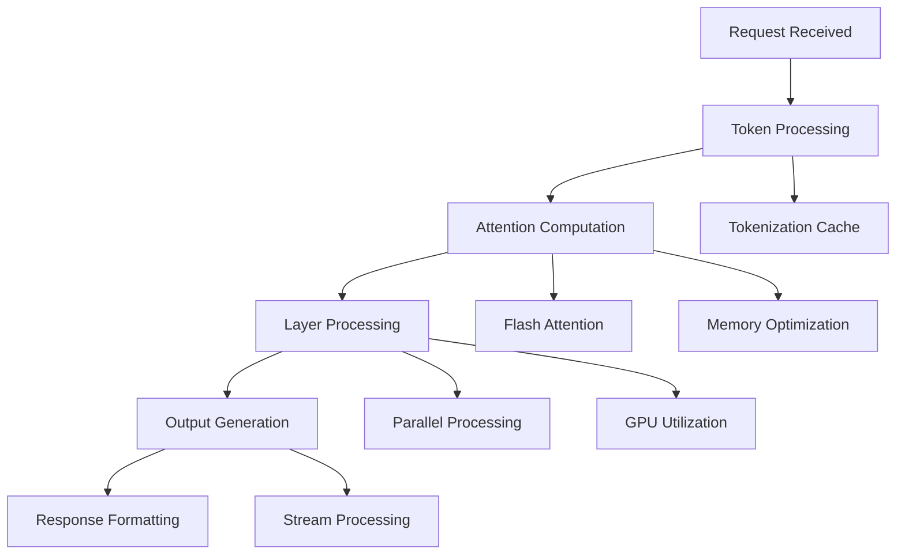
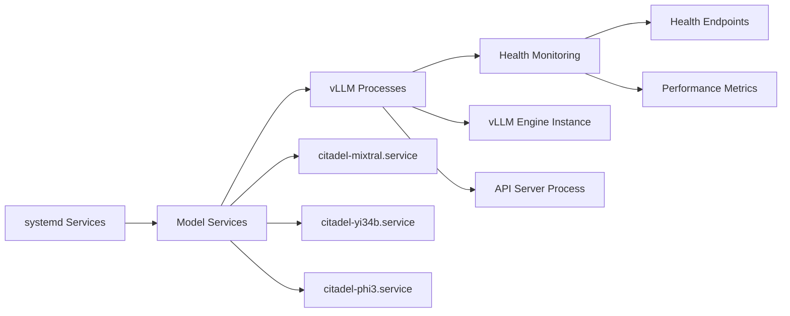
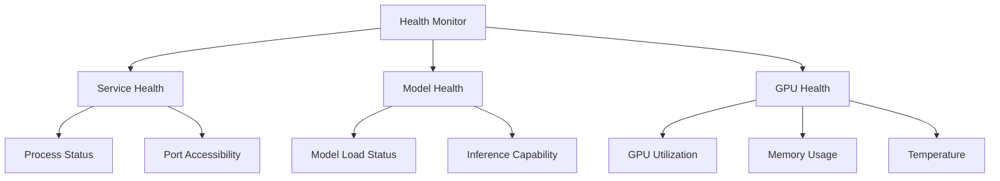

# vLLM Framework Architecture

**Component**: Core Inference Engine  
**Version**: vLLM 0.6.1+  
**Document Version**: 1.0  
**Created**: July 1, 2025  
**Integration**: Citadel AI LLM Server  

## Framework Overview

The vLLM framework serves as the core inference engine for the Citadel AI LLM Server, providing high-performance large language model serving with GPU acceleration, optimized memory management, and OpenAI-compatible APIs.

## vLLM Framework Architecture



## Configuration Management

### Pydantic-Based Settings Architecture

The framework uses a three-tier configuration system implemented through Pydantic settings classes:

#### 1. Installation Settings (`VLLMInstallationSettings`)
```python
# Key configuration parameters from configs/vllm_settings.py
class VLLMInstallationSettings(BaseSettings):
    dev_env_path: str = "/opt/citadel/dev-env"
    hf_token: str  # HuggingFace authentication
    hf_cache_dir: str = "/mnt/citadel-models/cache"
    gpu_memory_utilization: float = 0.7
    tensor_parallel_size: int = 1
    default_host: str = "0.0.0.0"
    default_port: int = 8000
```

#### 2. Model Settings (`VLLMModelSettings`)
```python
# Model-specific configuration
supported_models = [
    "mistralai/Mixtral-8x7B-Instruct-v0.1",
    "01-ai/Yi-34B-Chat", 
    "microsoft/Phi-3-mini-4k-instruct",
    "deepseek-ai/deepseek-coder-14b-instruct-v1.5"
]
download_timeout: int = 1800  # 30 minutes
max_context_length: int = 4096
```

#### 3. Test Settings (`VLLMTestSettings`)
```python
# Testing and validation configuration
test_model: str = "facebook/opt-125m"
test_timeout: int = 300
enable_performance_tests: bool = True
min_throughput: float = 1.0
```

### Environment Integration


## Model Management Architecture

### HuggingFace Integration


### Model Loading Strategy
1. **Cache Management**: Models cached in `/mnt/citadel-models/cache/`
2. **Memory Optimization**: Dynamic GPU memory allocation based on model size
3. **Parallel Loading**: Tensor parallel processing for large models
4. **Fallback Mechanisms**: Automatic retry and error recovery

### Supported Model Categories


## GPU Acceleration Architecture

### RTX 4070 Ti SUPER Optimization
- **VRAM**: 16GB GDDR6X optimized for 7B-34B parameter models
- **CUDA Cores**: 8448 cores with compute capability 8.9
- **Memory Bandwidth**: 672 GB/s for high-throughput inference
- **Tensor Cores**: 4th gen for accelerated transformer operations

### Memory Management Strategy


### Tensor Parallel Processing
```python
# Configuration for large models
tensor_parallel_configuration = {
    "7B_models": {"tensor_parallel_size": 1, "gpu_memory_util": 0.7},
    "13B_models": {"tensor_parallel_size": 1, "gpu_memory_util": 0.9},  
    "34B_models": {"tensor_parallel_size": 2, "gpu_memory_util": 0.85}  # Future multi-GPU
}
```

## API Server Architecture

### OpenAI Compatible Endpoints
```mermaid
graph LR
    A[Client Request] --> B[Load Balancer]
    B --> C[API Router]
    C --> D[Chat Completions]
    C --> E[Health Check]
    C --> F[Metrics]
    
    D --> D1[/v1/chat/completions]
    D --> D2[/v1/completions]
    
    E --> E1[/health]
    E --> E2[/ready]
    
    F --> F1[/metrics]
    F --> F2[/stats]
```

### Request Processing Pipeline


### Server Management Integration
The [`start_vllm_server.py`](../scripts/start_vllm_server.py) script implements the `VLLMServerManager` class with:

```python
class VLLMServerManager:
    def __init__(self):
        # Load configuration from Pydantic settings
        self.install_settings, self.model_settings, self.test_settings = load_vllm_settings()
        
    def start_vllm_server(self, model_path, port=None, **kwargs):
        # Dynamic configuration with fallbacks
        port = port or self.install_settings.default_port
        gpu_memory_utilization = kwargs.get('gpu_memory_utilization') or self.install_settings.gpu_memory_utilization
        
        # Server startup with environment integration
        cmd = [
            "python", "-m", "vllm.entrypoints.openai.api_server",
            "--model", model_path,
            "--host", self.install_settings.default_host,
            "--port", str(port),
            "--gpu-memory-utilization", str(gpu_memory_utilization),
            "--trust-remote-code"
        ]
```

## Performance Optimization

### Memory Optimization Strategies
1. **Dynamic Memory Allocation**: GPU memory allocated based on model requirements
2. **KV Cache Management**: Optimized key-value cache for attention mechanisms
3. **Batch Processing**: Dynamic batching for improved throughput
4. **Memory Defragmentation**: Automatic memory cleanup and optimization

### Inference Optimization


### Performance Characteristics
- **Latency**: Sub-second response times for most requests
- **Throughput**: 10-100 requests/second per model (model-dependent)
- **Concurrency**: Multiple model instances served simultaneously
- **Resource Utilization**: 60-90% GPU utilization under load

## Integration with Citadel System

### Service Integration


### Configuration Flow
1. **System Startup**: Systemd services load environment from `/etc/systemd/system/citadel-ai.env`
2. **Configuration Loading**: Pydantic settings validate and load configuration
3. **Model Initialization**: vLLM engines start with model-specific parameters
4. **Service Registration**: Health endpoints register with monitoring system

### Error Handling and Recovery
```python
# Error handling strategy implemented in server manager
try:
    process = subprocess.Popen(cmd, env=server_env)
    # Monitor process health
except Exception as e:
    logger.error(f"Server failed to start: {e}")
    # Trigger systemd restart mechanism
```

## Monitoring and Metrics

### Health Check Architecture


### Performance Metrics
- **Request Latency**: Average, P95, P99 response times
- **Throughput**: Requests per second per model
- **Resource Utilization**: GPU, CPU, memory usage
- **Error Rates**: Failed requests and error categorization

## Security and Access Control

### API Security
- **Authentication**: Token-based authentication for API access
- **Rate Limiting**: Request throttling to prevent abuse
- **Input Validation**: Request sanitization and validation
- **Output Filtering**: Response content filtering and safety checks

### Network Security
- **Port Isolation**: Model services on dedicated ports (11400-11500)
- **Firewall Rules**: Network access control and segmentation
- **TLS Encryption**: HTTPS endpoints for secure communication
- **Audit Logging**: Comprehensive request and access logging

## Troubleshooting and Diagnostics

### Common Issues and Solutions
1. **Model Loading Failures**
   - Check HuggingFace token authentication
   - Verify model cache integrity
   - Validate GPU memory availability

2. **Performance Issues**
   - Monitor GPU utilization and memory usage
   - Adjust batch sizes and memory allocation
   - Check for thermal throttling

3. **Service Startup Failures**
   - Validate configuration files
   - Check port availability
   - Review systemd service logs

### Diagnostic Commands
```bash
# Check vLLM installation
python -c "import vllm; print(vllm.__version__)"

# Test model loading
python scripts/test_vllm_installation.py

# Monitor GPU usage
nvidia-smi -l 1

# Check service health
curl http://localhost:11400/health
```

## Future Enhancements

### Scalability Improvements
- **Multi-GPU Support**: Expand to multiple RTX 4070 Ti SUPER cards
- **Model Sharding**: Support for larger models (70B+ parameters)
- **Load Balancing**: Advanced request routing and distribution
- **Caching Strategies**: Improved model and response caching

### Feature Additions
- **Streaming Responses**: Real-time token streaming
- **Custom Models**: Support for fine-tuned and custom models
- **Advanced Scheduling**: Intelligent request scheduling and batching
- **Integration APIs**: Enhanced integration with other Hana-X Lab services

---

**Integration Points**: This framework integrates with [Service Architecture](Service-Architecture.md), [Storage Architecture](Storage-Architecture.md), and [Monitoring Architecture](Monitoring-Architecture.md) components.