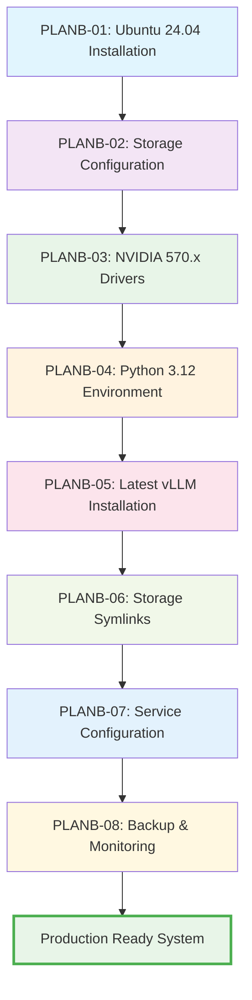

# Citadel AI OS Plan B - Installation Summary

**Version:** 5.0  
**Created:** June 30, 2025  
**Target Environment:** Fresh Ubuntu Server 24.04 LTS  
**Completion Status:** ✅ Ready for Implementation  

## Executive Summary

Plan B provides a comprehensive, production-ready installation approach for Citadel AI OS that resolves all compatibility issues encountered in the original deployment. This approach uses modern software versions and optimized configurations.

## Deployment Context

**Target Environment**: Hana-X Lab
**Target Server**: db.hana-x-lab (192.168.10.35)
**User Account**: agent0 (standardized across all services)
**Network Environment**: Hana-X Lab internal network (192.168.10.0/24)
**HF Authentication**: Pre-configured token integration

### Server Specifications (db - 192.168.10.35)
- **Hardware**: Dell Precision 3630 Tower
- **Operating System**: Ubuntu 24.04.2 LTS
- **Kernel**: Linux 6.11.0-26-generic
- **Architecture**: x86-64
- **Network Interface**: eno1 (a4:bb:6d:49:ef:d5)
- **Role**: PostgreSQL Database Server (repurposed for AI workloads)

### Network Integration
- **Primary Network**: 192.168.10.0/24
- **Gateway Access**: Standard Hana-X Lab routing
- **Service Ports**: 11400-11500 (model services)
- **Monitoring**: Integration with dev-ops node (192.168.10.36)

## Key Improvements Over Original Plan

### ✅ Compatibility Resolution
- **vLLM Version**: Updated from 0.2.7 to 0.6.1+ (compatible with modern PyTorch)
- **PyTorch Version**: 2.4+ with CUDA 12.4 support (vs outdated 2.1.2 requirement)
- **Python Version**: 3.12 (latest stable with performance improvements)
- **NVIDIA Drivers**: 570.x series (latest stable with optimizations)

### ✅ Storage Architecture Optimization
- **Dedicated Model Storage**: 3.6TB NVMe SSD for optimal I/O performance
- **Backup Integration**: 7.3TB HDD with automated backup strategies
- **Symlink Integration**: Seamless model access without storage constraints
- **Cache Optimization**: Intelligent cache placement on fast storage

### ✅ Production Readiness
- **Systemd Integration**: Full service management with dependency handling
- **Health Monitoring**: Real-time monitoring with automated alerting
- **Backup Strategy**: Multi-tier backup with validation and recovery procedures
- **Operational Tools**: Comprehensive management scripts and documentation

## Installation Overview



## Task Breakdown and Timeline

| Task | Duration | Complexity | Prerequisites |
|------|----------|------------|---------------|
| **PLANB-01**: Ubuntu Installation | 45-60 min | Medium | Hardware ready |
| **PLANB-02**: Storage Setup | 30-45 min | Medium | OS installed |
| **PLANB-03**: NVIDIA Drivers | 45-60 min | High | Storage configured |
| **PLANB-04**: Python Environment | 30-45 min | Medium | Drivers installed |
| **PLANB-05**: vLLM Installation | 60-90 min | High | Python ready |
| **PLANB-06**: Storage Symlinks | 20-30 min | Medium | vLLM installed |
| **PLANB-07**: Service Config | 45-60 min | High | Symlinks ready |
| **PLANB-08**: Backup/Monitor | 60-90 min | High | Services configured |

**Total Estimated Time**: 6-8 hours (can be done over multiple sessions)

## Hardware Requirements

### Minimum Specifications
- **CPU**: Intel Xeon or AMD EPYC (16+ cores)
- **RAM**: 128GB DDR4/DDR5
- **GPU**: 2x NVIDIA RTX 4070 Ti SUPER (32GB VRAM total)
- **Storage**: 
  - Primary NVMe: 4TB (OS and applications)
  - Secondary NVMe: 4TB (Model storage) 
  - Backup HDD: 8TB (Backup and archives)
- **Network**: 10Gbps+ connection

### Software Stack
- **OS**: Ubuntu Server 24.04 LTS
- **Python**: 3.12 (latest stable)
- **NVIDIA**: Driver 570.x + CUDA 12.4+
- **vLLM**: 0.6.1+ (latest compatible)
- **PyTorch**: 2.4+ with CUDA support

## Storage Architecture

```
Storage Layout:
├── nvme0n1 (Primary - 4TB)          # OS, applications, swap
│   ├── /boot/efi (1GB)              # EFI system partition
│   ├── /boot (2GB)                  # Boot partition  
│   └── LVM (3.9TB)                  # Root, home, opt, var, tmp
├── nvme1n1 (Models - 3.6TB)         # Dedicated model storage
│   ├── /mnt/citadel-models          # Active models
│   └── Cache/temp directories
└── sda (Backup - 7.3TB)             # Backup and archives
    ├── /mnt/citadel-backup          # Automated backups
    └── Long-term storage
```

## Service Architecture

```
Systemd Services:
├── citadel-ai.target                # Main orchestration target
├── citadel-storage.service          # Storage verification
├── citadel-gpu.service              # GPU optimization
├── citadel-models.target            # Model services orchestration
│   ├── citadel-mixtral.service      # Mixtral 8x7B
│   ├── citadel-yi34b.service        # Yi-34B
│   ├── citadel-hermes.service       # Nous Hermes 2
│   ├── citadel-openchat.service     # OpenChat 3.5
│   ├── citadel-phi3.service         # Phi-3 Mini
│   ├── citadel-coder.service        # DeepCoder 14B
│   └── citadel-vision.service       # MiMo VL 7B
└── citadel-monitor.service          # Health monitoring
```

## Key Features

### 🚀 Performance Optimizations
- **GPU Configuration**: Optimal settings for AI workloads
- **Storage I/O**: NVMe optimization with proper schedulers
- **Memory Management**: Python and system memory optimization
- **Threading**: Multi-GPU aware threading configuration

### 🔒 Reliability Features
- **Service Dependencies**: Proper startup and shutdown ordering
- **Health Monitoring**: Automated service restart on failure
- **Backup Validation**: Integrity checking and recovery testing
- **Resource Monitoring**: Proactive alerting on resource constraints

### 🛠 Management Tools
- **citadel**: Unified service management command
- **Monitoring Dashboard**: Real-time system status
- **Backup Scripts**: Automated backup and validation
- **Diagnostic Tools**: Comprehensive troubleshooting utilities

### 📊 Monitoring & Alerting
- **Real-time Metrics**: System, GPU, storage, and service metrics
- **Threshold Alerts**: Automated alerting on resource usage
- **Historical Data**: 30-day metric retention
- **Log Management**: Automated log rotation and archival

## Quick Start Commands

After completing all installation tasks:

```bash
# Check system status
citadel health

# Start all services
citadel start

# View monitoring dashboard
/opt/citadel/scripts/monitoring-dashboard.py

# Run backup validation
/opt/citadel/scripts/validate-backups.sh

# View service logs
citadel logs monitor
```

## Validation Checklist

### ✅ System Validation
- [ ] Ubuntu 24.04 LTS installed and updated
- [ ] All storage devices mounted with optimal settings
- [ ] NVIDIA drivers and CUDA installed and functional
- [ ] Python 3.12 with virtual environments configured
- [ ] vLLM latest version installed and tested

### ✅ Storage Validation  
- [ ] Model storage symlinks working correctly
- [ ] Cache directories properly redirected
- [ ] Backup storage configured and tested
- [ ] Symlink integrity verification passing

### ✅ Service Validation
- [ ] All systemd services enabled and starting
- [ ] Service dependencies working correctly
- [ ] Health monitoring active and alerting
- [ ] Model services responding to health checks

### ✅ Backup Validation
- [ ] Automated backup schedule configured
- [ ] Backup integrity validation passing
- [ ] Recovery procedures tested
- [ ] Monitoring data collection active

## Troubleshooting Resources

### Common Issues
1. **vLLM Compatibility**: Use latest 0.6.x version with PyTorch 2.4+
2. **Storage Performance**: Verify NVMe optimizations and mount options
3. **Service Dependencies**: Check systemd service ordering and requirements
4. **GPU Access**: Verify NVIDIA drivers and CUDA installation

### Support Tools
- **System Diagnostics**: `/opt/citadel/scripts/system-diagnostics.sh`
- **Storage Verification**: `/opt/citadel/scripts/verify-symlinks.sh`
- **Service Management**: `citadel health` and `citadel status`
- **Log Analysis**: `journalctl -u citadel-ai.target -f`

## Success Metrics

### Performance Targets
- **Model Loading**: < 60 seconds per model
- **Inference Latency**: < 2 seconds for standard requests
- **Throughput**: > 10 requests/second per model
- **GPU Utilization**: > 80% during active inference

### Reliability Targets
- **Uptime**: > 99.9% service availability
- **Recovery Time**: < 5 minutes for service restart
- **Backup Success**: > 99% backup completion rate
- **Alert Response**: < 1 minute for critical alerts

## Production Deployment Notes

### Security Considerations
- **Firewall Configuration**: Model API ports (11400-11500) for Hana-X Lab network
- **SSH Authentication**: Key-based authentication for agent0 user
- **Service Isolation**: User isolation with agent0 account and proper permissions
- **Network Security**: Hana-X Lab internal network (192.168.10.0/24) access controls
- **HF Token Security**: Secure token storage and rotation procedures
- **Regular Updates**: Security patching and system updates

### Scaling Considerations
- Additional GPU nodes for horizontal scaling
- Load balancing for high availability
- Model versioning and deployment strategies
- Resource monitoring and capacity planning

### Maintenance Schedule
- **Daily**: Automated backups and health checks
- **Weekly**: System updates and log review
- **Monthly**: Full backup validation and disaster recovery testing
- **Quarterly**: Performance optimization review

---

## Conclusion

Plan B provides a robust, production-ready foundation for Citadel AI OS that addresses all compatibility issues while providing enterprise-grade reliability, monitoring, and management capabilities. The modular approach allows for staged implementation and validation at each step.

**Ready for Production Deployment**: ✅  
**Estimated ROI**: Immediate productivity gains with reduced maintenance overhead  
**Support Level**: Comprehensive documentation and operational procedures included  

For implementation support or questions, refer to the detailed task documentation in the `tasks/` directory.