# PLANB-05 vLLM Installation - Complete Implementation Guide

**Version:** 1.0  
**Created:** June 30, 2025  
**Task:** Implement PLANB-05 vLLM Installation with scripts and validation procedures  
**Target:** Latest compatible vLLM (0.6.1+) replacing problematic 0.2.7 version  

## Executive Summary

This implementation guide provides complete scripts and procedures to implement PLANB-05 vLLM Installation, addressing the compatibility issues identified in the existing `/opt/citadel/scripts/vllm_installation.sh` which uses the problematic vLLM 0.2.7 version.

## Current State Analysis

### ❌ Issues with Existing Installation
- **Problematic vLLM Version**: Current script uses vLLM 0.2.7 (incompatible with Python 3.12 and PyTorch 2.4+)
- **Wrong Environment**: Uses separate `vllm-env` instead of Plan B's standardized `/opt/citadel/dev-env`
- **Missing HF Integration**: No Hugging Face token automation
- **User Mismatch**: Not aligned with agent0 user standardization

### ✅ Plan B Solutions
- **Latest vLLM**: Upgrade to vLLM 0.6.1+ (compatible with PyTorch 2.4+ and Python 3.12)
- **Standardized Environment**: Use `/opt/citadel/dev-env` as specified in Plan B
- **HF Token Integration**: Automated authentication setup
- **Agent0 Alignment**: All configurations use agent0 user

## Implementation Architecture

```mermaid
graph TD
    A[PLANB-05 Implementation] --> B[Environment Preparation]
    B --> C[System Dependencies Setup]
    C --> D[Choose Installation Method]
    
    D --> E[Quick Install<br/>15-30 minutes]
    D --> F[Detailed Install<br/>60-90 minutes]
    
    E --> G[Single Command<br/>Latest vLLM + Dependencies]
    F --> H[Step-by-Step<br/>Full Control + Debug]
    
    G --> I[HF Token Integration]
    H --> I
    
    I --> J[Flash Attention<br/>Optional Performance]
    J --> K[Service Scripts Creation]
    K --> L[Validation Testing]
    
    L --> M[Installation Tests]
    L --> N[Functionality Tests]
    L --> O[Performance Tests]
    
    M --> P[✅ PLANB-05 Complete]
    N --> P
    O --> P
    
    style A fill:#e3f2fd
    style E fill:#fff3e0
    style F fill:#fce4ec
    style I fill:#e1f5fe
    style P fill:#e8f5e8,stroke:#4caf50,stroke-width:3px
```



## Script Collection

The following scripts have been created and are available in the [`/scripts/`](../scripts/) directory:

### 1. Main Installation Script
**Location**: [`/scripts/vllm_latest_installation.sh`](../scripts/vllm_latest_installation.sh)
- **Purpose**: Complete interactive installation with full control and options
- **Duration**: 60-90 minutes
- **Features**: Prerequisites checking, system dependencies, compilation environment setup, choice between quick/detailed install
- **Usage**: `./scripts/vllm_latest_installation.sh`

### 2. Quick Installation Script
**Location**: [`/scripts/vllm_quick_install.sh`](../scripts/vllm_quick_install.sh)
- **Purpose**: Fast installation for immediate deployment
- **Duration**: 15-30 minutes
- **Features**: Single-command installation with all dependencies
- **Usage**: `./scripts/vllm_quick_install.sh`

### 3. Installation Test Script
**Location**: [`/scripts/test_vllm_installation.py`](../scripts/test_vllm_installation.py)
- **Purpose**: Comprehensive testing and validation suite
- **Features**: 6-layer testing (import, CUDA, dependencies, auth, engine, performance)
- **Usage**: `python ./scripts/test_vllm_installation.py`

### 4. vLLM Server Script
**Location**: [`/scripts/start_vllm_server.py`](../scripts/start_vllm_server.py)
- **Purpose**: Server startup and management
- **Features**: OpenAI-compatible API server with configurable options
- **Usage**: `python ./scripts/start_vllm_server.py <model_path> [--port 8000] [--host 0.0.0.0]`

### 5. Client Test Script
**Location**: [`/scripts/test_vllm_client.py`](../scripts/test_vllm_client.py)
- **Purpose**: API client testing and validation
- **Features**: Health check and completion endpoint testing
- **Usage**: `python ./scripts/test_vllm_client.py [--url http://localhost:8000] [--model test]`

## Implementation Execution Plan

### Phase 1: Script Verification
1. **Verify Scripts are Available**
   ```bash
   ls -la scripts/
   # Should show all 5 scripts with executable permissions
   ```

2. **Check Script Permissions**
   ```bash
   chmod +x scripts/*.sh scripts/*.py
   ```

### Phase 2: Execute Installation
1. **Run Main Installation Script**
   ```bash
   ./scripts/vllm_latest_installation.sh
   ```

2. **Or Use Quick Install**
   ```bash
   ./scripts/vllm_quick_install.sh
   ```

### Phase 3: Validation and Testing
1. **Run Installation Tests**
   ```bash
   python ./scripts/test_vllm_installation.py
   ```

2. **Test Server Functionality**
   ```bash
   # Start server (in background)
   python ./scripts/start_vllm_server.py facebook/opt-125m &
   
   # Test client
   python ./scripts/test_vllm_client.py
   ```

## Troubleshooting Guide

### Common Issues and Solutions

#### Issue: vLLM Version Compatibility
**Symptoms**: Import errors, version conflicts
**Solution**: 
- Verify using latest vLLM (0.6.1+): `pip show vllm`
- Check PyTorch version: `python -c "import torch; print(torch.__version__)"`
- Reinstall if version is wrong: `pip install --upgrade vllm`

#### Issue: CUDA Not Available
**Symptoms**: `torch.cuda.is_available()` returns False
**Solution**:
- Check NVIDIA drivers: `nvidia-smi`
- Verify CUDA installation: `nvcc --version`
- Reinstall PyTorch with CUDA: `pip install torch --index-url https://download.pytorch.org/whl/cu124`

#### Issue: Compilation Failures
**Symptoms**: Build errors during installation
**Solution**:
- Install build dependencies: `sudo apt install build-essential cmake ninja-build`
- Set compilation environment variables (included in main script)
- Use pre-compiled wheels when available

#### Issue: Memory Errors
**Symptoms**: OOM during installation or testing
**Solution**:
- Reduce `MAX_JOBS` environment variable
- Use lower `gpu_memory_utilization` (0.3-0.5)
- Close other applications during installation

## Success Criteria

### ✅ Installation Success Indicators
- [ ] vLLM version 0.6.1+ installed successfully
- [ ] All dependency tests pass
- [ ] CUDA availability confirmed
- [ ] HF authentication working
- [ ] Small model inference test passes
- [ ] Performance benchmark completes

### ✅ Integration Success Indicators
- [ ] Uses `/opt/citadel/dev-env` environment (not separate vllm-env)
- [ ] HF token automatically configured
- [ ] Agent0 user ownership maintained
- [ ] Compatible with existing Plan B structure

## Next Steps

After successful completion of PLANB-05:

1. **Proceed to PLANB-06**: Storage Symlinks configuration
2. **Update Service Scripts**: Integrate with systemd services
3. **Model Installation**: Download and configure models
4. **Performance Optimization**: Fine-tune GPU and memory settings

---

## Implementation Summary

This comprehensive guide provides:
- ✅ **Complete Script Collection**: All necessary scripts for PLANB-05 implementation
- ✅ **Two Installation Methods**: Quick (15-30 min) and Detailed (60-90 min) options
- ✅ **Comprehensive Testing**: Multi-layer validation and verification
- ✅ **Troubleshooting Guide**: Solutions for common issues
- ✅ **Integration Ready**: Aligned with Plan B architecture and standards

**Status**: 🎯 **Ready for Implementation**
**Next Action**: Execute the scripts in the specified sequence and validate results