# README.md Comprehensive Enhancement Plan

**Document Version**: 1.0  
**Created**: July 1, 2025  
**Purpose**: Detailed implementation plan for enhancing the main README.md with architecture, performance, and development guidance  
**Target Outcome**: Comprehensive README maintaining existing value while adding high-impact enhancements  

## Executive Summary

This plan outlines the comprehensive enhancement of [`README.md`](../README.md) by integrating key content from the architecture documentation suite. The enhancement maintains the valuable existing structure (214 lines) while strategically adding high-impact sections for architecture diagrams, performance characteristics, and development setup guidance, targeting a final document of ~350-400 lines.

## Current README Strengths to Preserve

### ✅ Existing Value
- **Clear Project Purpose**: LLM inference server with vLLM framework
- **Deployment Environment**: Hardware specs and network topology (192.168.10.36)
- **Sequential Installation Tasks**: PLANB-01 through PLANB-08 structure
- **Directory Structure**: Comprehensive project organization
- **Production Readiness**: Status indicators and validation procedures
- **Technical Specifications**: Hardware optimization and storage configuration

### ✅ Existing Structure Quality
- Professional markdown formatting and hierarchy
- Logical flow from overview to implementation details
- Comprehensive technical detail and hardware specifications
- Clear task breakdown with dependencies
- Integration with systemd services and monitoring

## Enhancement Strategy

```mermaid
graph TB
    subgraph "Enhancement Sources"
        A[architecture/diagrams/README.md<br/>110 lines]
        B[architecture/Engineering-Team-Onboarding.md<br/>530 lines]  
        C[architecture/LLM-Server-Architecture-Overview.md<br/>295 lines]
    end
    
    subgraph "Current README"
        D[README.md<br/>214 lines<br/>Existing Structure]
    end
    
    subgraph "Enhanced README"
        E[Comprehensive README<br/>~350-400 lines<br/>Integrated Content]
    end
    
    subgraph "Key Additions"
        F[🏗️ Architecture Diagrams<br/>Integration]
        G[⚡ Performance<br/>Characteristics]
        H[🛠️ Development<br/>Environment Setup]
        I[👥 Team Quick<br/>Reference]
    end
    
    A --> F
    B --> G
    B --> H
    C --> G
    C --> I
    
    D --> E
    F --> E
    G --> E
    H --> E
    I --> E
```



## Detailed Enhancement Plan

### Phase 1: Architecture Integration 🏗️

**Objective**: Add architectural context and visual references

**New Section: Architecture Overview**
- **Location**: After "Overview" section
- **Content Source**: [`architecture/diagrams/README.md`](../architecture/diagrams/README.md) + [`architecture/LLM-Server-Architecture-Overview.md`](../architecture/LLM-Server-Architecture-Overview.md)
- **Key Components**:
  - Architecture diagrams reference (7 comprehensive Mermaid diagrams)
  - Component interaction overview
  - System architecture visualization
  - Viewing instructions for diagrams

**Content Integration**:
```markdown
## 🏗️ Architecture Overview

### Visual Architecture Reference
The system architecture is documented through 7 comprehensive diagrams available in [`architecture/diagrams/`](architecture/diagrams/):

| Diagram | Purpose | Key Components |
|---------|---------|----------------|
| **System Overview** | Complete system architecture | Client → Service → vLLM → GPU → Storage layers |
| **Service Interactions** | SystemD service relationships | Service dependencies, health monitoring |
| **Data Flow** | Request processing pipeline | Request → Processing → GPU → Response flow |
| **Storage Architecture** | Multi-tier storage system | NVMe/HDD, symlinks, backups |
| **Monitoring** | Observability stack | Prometheus, Grafana, alerting |
| **Configuration** | Config management & deployment | Pydantic settings, validation |
| **Network Topology** | Network architecture | Hana-X Lab network, ports, security |

### Viewing Architecture Diagrams
- **Mermaid Live Editor**: Copy content from `.mermaid` files to [mermaid.live](https://mermaid.live/)
- **VSCode**: Install "Mermaid Markdown Syntax Highlighting" extension
- **GitHub**: Automatic rendering in repository browser
```

### Phase 2: Performance Characteristics ⚡

**Objective**: Add comprehensive performance specifications and benchmarks

**Enhanced Section: Performance Characteristics**
- **Location**: New section after "LLM Server Capabilities"
- **Content Source**: [`architecture/LLM-Server-Architecture-Overview.md`](../architecture/LLM-Server-Architecture-Overview.md) + [`architecture/Engineering-Team-Onboarding.md`](../architecture/Engineering-Team-Onboarding.md)

**Key Performance Metrics**:
```markdown
## ⚡ Performance Characteristics

### Hardware Utilization
- **GPU Memory**: Optimized allocation per model (60-90% utilization)
- **System Memory**: 128GB supporting large context processing
- **Storage I/O**: 3,500 MB/s NVMe reads for fast model loading (<30 seconds for 7B models)
- **Network**: Gigabit Ethernet with sub-millisecond local network latency

### Service Performance
- **Inference Latency**: <100ms first token, <50ms subsequent tokens
- **Throughput**: 1000+ tokens/second sustained across models
- **Concurrent Models**: 7 models served simultaneously
- **Request Throughput**: Model-dependent (10-100 requests/second per model)
- **Service Availability**: 99.9%+ uptime with automatic restart and health monitoring

### Scalability Considerations
- **Model Size Limits**: 34B parameters maximum with current GPU configuration
- **Memory Efficiency**: Dynamic attention and KV-cache optimization
- **Horizontal Scaling**: Additional GPU nodes can be added to Hana-X Lab network
- **Resource Optimization**: Dynamic GPU memory allocation based on model requirements
```

### Phase 3: Development Environment Setup 🛠️

**Objective**: Provide comprehensive developer onboarding and setup guidance

**New Section: Development Environment Setup**
- **Location**: After "Performance Characteristics"
- **Content Source**: [`architecture/Engineering-Team-Onboarding.md`](../architecture/Engineering-Team-Onboarding.md) (lines 138-197)

**Developer Setup Content**:
```markdown
## 🛠️ Development Environment Setup

### Prerequisites Checklist
```bash
# System Requirements
□ Ubuntu 24.04 LTS (or compatible Linux)
□ Python 3.12+ with pip and venv
□ NVIDIA Driver 570.x+ with CUDA 12.4+
□ Git access to project repository
□ Network access to 192.168.10.36 (Hana-X Lab)

# Development Tools
□ VSCode or PyCharm with Python extensions
□ Docker (optional, for containerized development)
□ SSH access for remote development
```

### Quick Start Commands
```bash
# 1. Clone and setup environment
git clone <repository-url> Citadel-Alpha-LLM-Server-1
cd Citadel-Alpha-LLM-Server-1
python3 -m venv venv
source venv/bin/activate

# 2. Install dependencies
pip install -r requirements.txt
pip install vllm>=0.6.1 torch>=2.1.0

# 3. Load configuration
cp .env.example .env
source configs/storage-env.sh

# 4. Verify setup
python3 scripts/test_vllm_installation.py
python3 scripts/storage_orchestrator.py status
```

### Essential Configuration Files
- **[`configs/vllm_settings.py`](configs/vllm_settings.py)** - Pydantic vLLM configuration
- **[`configs/storage_settings.py`](configs/storage_settings.py)** - Storage and backup settings
- **[`configs/vllm-config.yaml`](configs/vllm-config.yaml)** - YAML configuration templates
- **[`.env.example`](.env.example)** - Environment variable templates

### Development Workflow
```bash
# Daily development workflow
source venv/bin/activate
source configs/storage-env.sh
python3 scripts/storage_orchestrator.py status

# Code formatting and validation
black scripts/ configs/ tests/
mypy scripts/ configs/
pytest tests/ -v

# Local testing
python3 scripts/start_vllm_server.py --model phi3 --port 11403
curl http://localhost:11403/v1/models
```
```

### Phase 4: Operational Dashboard 📊

**Objective**: Add comprehensive operational procedures and management commands

**New Section: Operational Dashboard**
- **Location**: After "Quick Start" section
- **Content Source**: [`architecture/Engineering-Team-Onboarding.md`](../architecture/Engineering-Team-Onboarding.md) (lines 360-456)

**Operational Content**:
```markdown
## 📊 Operational Dashboard

### System Management Commands

#### Service Management
```bash
# Start complete system
sudo systemctl start citadel-ai.target

# Individual model services
sudo systemctl start citadel-mixtral.service
sudo systemctl start citadel-phi3.service

# Status monitoring
python3 scripts/storage_orchestrator.py status
systemctl status citadel-ai.target --no-pager
```

#### Storage Operations
```bash
# Storage health check
python3 scripts/storage_monitor.py status

# Backup operations
python3 scripts/backup_manager.py create /mnt/citadel-models/active incremental
python3 scripts/backup_manager.py verify /mnt/citadel-backup/models/latest

# Symlink management
python3 scripts/storage_manager.py verify-symlinks
python3 scripts/storage_manager.py repair-symlinks
```

#### Performance Monitoring
```bash
# Real-time performance
python3 scripts/storage_monitor.py performance /mnt/citadel-models
nvidia-smi -l 1
iotop -o

# Web dashboards
http://192.168.10.36:3000  # Grafana dashboards
http://192.168.10.36:9090  # Prometheus metrics
```

### Troubleshooting Quick Reference

| Issue | Symptoms | Solution |
|-------|----------|----------|
| **GPU Memory Error** | CUDA OOM errors | Reduce [`VLLM_GPU_MEMORY_UTILIZATION`](configs/vllm_settings.py) |
| **Storage Full** | Disk space warnings | Run [`backup_manager.py cleanup`](scripts/backup_manager.py) |
| **Broken Symlinks** | Model loading fails | Run [`storage_manager.py repair-symlinks`](scripts/storage_manager.py) |
| **Service Startup** | SystemD failures | Check [`journalctl -u citadel-ai.target`](configs/systemd-services/) |
| **Performance Slow** | High latency | Check [`storage_monitor.py performance`](scripts/storage_monitor.py) |
```

## Implementation Structure

### Enhanced README Section Layout
```markdown
# Citadel AI OS Plan B - LLM Server Implementation Guide

## Project Purpose [EXISTING - ENHANCED]

## Overview [EXISTING]

## 🏗️ Architecture Overview [NEW]
### Visual Architecture Reference
### Component Interactions  
### System Diagrams

## Deployment Environment [EXISTING]

## ⚡ Performance Characteristics [NEW]
### Hardware Utilization
### Service Performance
### Scalability Considerations

## 🛠️ Development Environment Setup [NEW]
### Prerequisites Checklist
### Quick Start Commands
### Development Workflow

## LLM Server Capabilities [EXISTING]

## Storage Configuration [EXISTING]

## Installation Tasks [EXISTING]

## Directory Structure [EXISTING - ENHANCED]

## Quick Start [EXISTING - ENHANCED]

## 📊 Operational Dashboard [NEW]
### System Management
### Performance Monitoring
### Troubleshooting Quick Reference

## Support and Troubleshooting [EXISTING]

## Production Readiness Features [EXISTING - ENHANCED]
```

## Quality Assurance Guidelines

### Content Integration Principles
1. **Preserve Existing Value** - Maintain all current technical details and task structure
2. **Strategic Additions** - Add high-impact content without overwhelming the reader
3. **Cross-References** - Link to detailed architecture documents for deeper exploration
4. **Practical Focus** - Emphasize actionable information for developers and operators
5. **Consistency** - Maintain existing markdown structure and formatting standards

### Technical Accuracy Requirements
- Ensure all file references point to valid locations
- Verify command syntax and paths are correct
- Maintain consistency with current system specifications
- Balance technical detail with readability
- Preserve existing links and navigation structure

### Documentation Standards
- Follow existing markdown formatting conventions
- Use consistent heading hierarchy and numbering
- Maintain professional tone and technical precision
- Include proper code block syntax highlighting
- Ensure all mermaid diagrams render correctly

## Expected Outcomes

### Quantitative Targets
- **Final Length**: ~350-400 lines (vs current 214 lines)
- **New Sections**: 4 major additions (Architecture, Performance, Development, Operations)
- **Enhanced Sections**: 3 existing sections with additional content
- **Cross-References**: 15+ links to detailed architecture documents

### Qualitative Improvements
- **Comprehensive Overview**: Complete system understanding in single document
- **Developer-Friendly**: Clear setup and development workflow guidance
- **Operationally-Aware**: Management commands and troubleshooting procedures
- **Architecture-Integrated**: Visual references and component relationships
- **Performance-Transparent**: Clear specifications and benchmarks

### User Experience Benefits
- **New Developers**: Faster onboarding with clear setup instructions
- **System Operators**: Quick reference for management commands
- **Architecture Teams**: Visual overview of system components
- **Performance Engineers**: Clear benchmarks and optimization targets

## Implementation Timeline

### Phase 1: Architecture Integration (1-2 hours)
- Add architecture overview section
- Integrate diagram references and viewing instructions
- Include component interaction summaries

### Phase 2: Performance Enhancement (1 hour)
- Add comprehensive performance characteristics
- Include hardware utilization specifications
- Document scalability considerations

### Phase 3: Development Setup (1-2 hours)
- Create development environment setup section
- Add prerequisites checklist and quick start commands
- Include essential configuration file references

### Phase 4: Operational Dashboard (1 hour)
- Add system management command reference
- Include troubleshooting quick reference table
- Integrate monitoring and backup procedures

### Phase 5: Final Polish (30 minutes)
- Cross-reference validation and link verification
- Formatting consistency review
- Technical accuracy validation

## Success Criteria

### Primary Objectives
- ✅ Maintain all existing valuable content and structure
- ✅ Successfully integrate architecture diagrams and visual references
- ✅ Add comprehensive performance characteristics and benchmarks
- ✅ Provide clear development environment setup guidance
- ✅ Include practical operational procedures and troubleshooting

### Secondary Objectives
- ✅ Enhance developer onboarding experience
- ✅ Improve system management efficiency
- ✅ Increase architecture understanding and visibility
- ✅ Maintain professional documentation standards
- ✅ Create comprehensive single-source project overview

---

**Ready for Implementation**: This plan provides a comprehensive roadmap for enhancing the README.md while preserving its existing value and adding high-impact architectural, performance, and operational content.

**Next Step**: Switch to Code mode to implement the README enhancements according to this detailed plan.